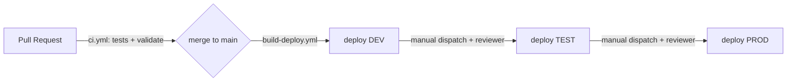

# CI/CD & Environment Promotion

Keyless CI/CD via **GitHub Actions + Workload Identity Federation** (no SA keys), with **Cloud Build**
as an alternative build path. Promotion **dev → test → prod** is gated by **GitHub Environments**.

> GitHub Actions workflows live in [`.github/workflows/`](../.github/workflows/) (must be there to run).
> This folder holds the Cloud Build config, WIF setup, and the promotion docs.

## Workflows

| Workflow | Trigger | Does |
|----------|---------|------|
| [`ci.yml`](../.github/workflows/ci.yml) | PR + push | pytest (pipeline + risk), generator invariant, `terraform fmt/validate` (dev/test/prod), docker build (no push) |
| [`build-deploy.yml`](../.github/workflows/build-deploy.yml) | push to `main` (→dev) / manual (→env) | WIF auth → build+push images → deploy Cloud Run → build Flex Template |
| [`infra.yml`](../.github/workflows/infra.yml) | PR (plan) / manual (plan\|apply) | `terraform plan` on PRs, gated `apply` per env |

## One-time setup

```bash
./scripts/setup_wif.sh strongsville-city-schools jeremydegardeyn/finchat dev
```

Then create **GitHub Environments** `dev`, `test`, `prod` (Settings → Environments) and set per-env
**variables**: `GCP_PROJECT`, `GCP_REGION`, `WIF_PROVIDER`, `DEPLOY_SA` (printed by the script). Add
**required reviewers** on `test` and `prod` to enforce promotion approval.

## Promotion strategy (dev → test → prod)



1. **PR** → `ci.yml` runs tests + `terraform validate` + image builds. Must pass to merge.
2. **Merge to `main`** → auto build + deploy to **dev**.
3. **Promote to test/prod** → manually dispatch `build-deploy.yml` / `infra.yml` with the target
   environment; the GitHub Environment's **required reviewers** must approve before it runs.
4. **Same artifact, env-specific config**: images are immutable (tagged by commit SHA); only env vars
   and Terraform `tfvars` differ. Cost/enterprise toggles flip via tfvars (ADR-0002).

## Two service-account roles

- **App deploy** uses `finchat-<env>-cicd` (run.developer, artifactregistry.writer, …) — enough to
  build/push/deploy services.
- **Terraform apply** needs broader project-admin roles. Either grant the deploy SA those roles in a
  controlled way, or run `terraform apply` from a privileged break-glass identity. `infra.yml` runs
  `plan` freely; restrict `apply` to approved environments/reviewers.
