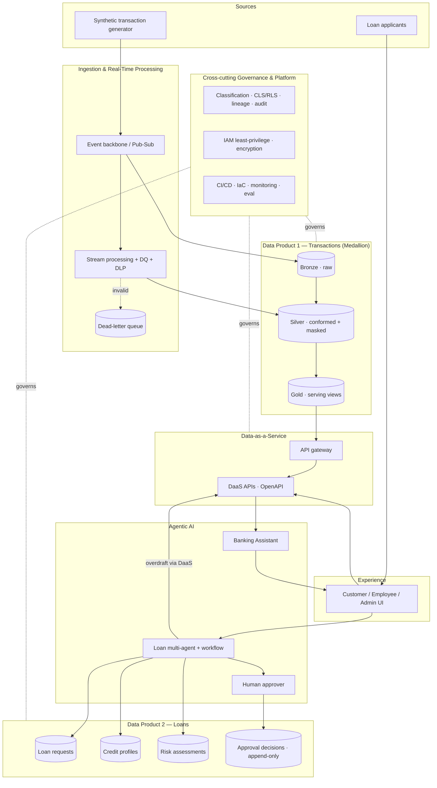

# 01 — Logical Architecture

> Capability/layer view of the platform, independent of specific GCP resources (those are in
> [02](02-physical-architecture.md)). Shows how the two data products, the serving layer, agents, and
> governance fit the data-mesh model.

## Layers

| Layer | Responsibility | Key principle |
|-------|----------------|---------------|
| Sources | Produce raw events / requests | Decoupled from consumers |
| Ingestion & RT | Transport, validate, mask, route | Event-driven, schema-enforced, DLQ |
| Data Products | Own curated, governed data | Data as a Product (medallion; append-only loans) |
| Data-as-a-Service | Expose governed data | API-first, contract-driven |
| Agentic AI | Reason + act over data | Grounded, tool-calling, evaluated |
| Governance/Platform | Cross-cutting controls | Least privilege, lineage, IaC, AgentOps |
| Experience | Role-based UX | Persona-scoped access |

## Data-mesh framing

Each data product is independently owned, deployable, and governed, yet **interoperable**: the Loan
product consumes the Transaction product's overdraft signal through the same governed DaaS contract
every other consumer uses — federated computational governance, not point-to-point coupling.
