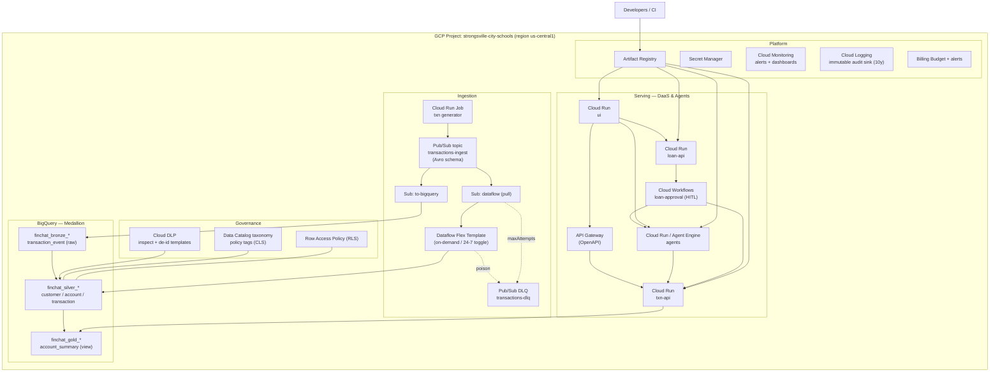

# 02 — Physical Architecture & Terraform Structure

> The concrete GCP resources provisioned by [`infra/`](../infra/), how they connect, and how the
> Terraform is organized. Logical view is in [01](01-logical-architecture.md); data flow in
> [03](03-data-flow.md).

## Physical resource diagram

## Resource inventory (per environment)

| Module | Key resources |
|---|---|
| `foundation` | 27 enabled APIs · 6 service accounts (least-priv) · Artifact Registry · dataflow + bronze-raw GCS buckets · optional billing budget |
| `iam` | 3 custom roles: DaaS reader, loan approver (append-only), pipeline operator |
| `bigquery` | 3 datasets · Bronze `transaction_event` · Silver `customer`/`account`/`transaction` (partitioned+clustered, PII policy tags) · Gold `account_summary` authorized view · row-access-policy DDL job |
| `pubsub` | ingest topic (+Avro schema) · DLQ topic+sub · BigQuery subscription · Dataflow pull subscription (dead-letter + retry) |
| `dlp` | PII inspect template · de-identify template (mask + deterministic crypto) |
| `dataflow` | Flex Template runner (on-demand) / streaming-job toggle |
| `cloud_run` | txn-api · loan-api · agent · ui (all scale-to-zero) |
| `api_gateway` | API + config + gateway (toggle) |
| `workflows` | loan-approval workflow (toggle) |
| `monitoring` | email channel · DLQ backlog alert · audit log sink + 10y bucket |

## Terraform structure

See [`infra/README.md`](../infra/README.md). Highlights:

- **Modules vs. envs:** reusable modules in `modules/`, composed in `envs/{dev,test,prod}/`.
- **State:** GCS backend, one bucket per env; provider versions pinned via committed lock file.
- **Promotion:** dev→test→prod is a `terraform.tfvars` change; the **enterprise toggles**
  (`enable_streaming_job`, `run_min_instances`, `enable_api_gateway`, `enable_workflows`) move the
  deployment from the sandbox cost profile to the enterprise profile **without code changes**
  (ADR-0002).
- **Validated:** `terraform fmt` + `terraform validate` pass on Terraform 1.8.5 / google 6.x.
