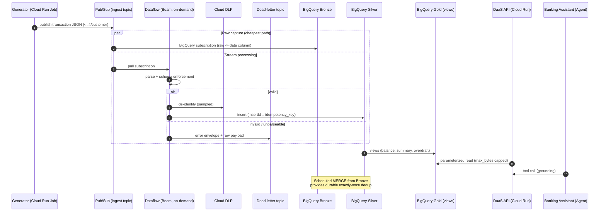

# 03 — Data Flow Diagram

> End-to-end flow of a transaction from generation to consumption, including the governance and
> dead-letter paths. Implementation: [`products/transactions/`](../products/transactions/).

## Transaction ingestion → serving

## Why two ingest paths

- **Pub/Sub → BigQuery subscription** writes the raw payload straight to Bronze: cheapest, scale-to-zero, immutable capture (replay/audit).
- **Pub/Sub → Dataflow → Silver** does the real work: validation, schema enforcement, DLP de-identification, enrichment, and DLQ routing.

Both consume the same topic independently (fan-out) — a core benefit of the event-driven backbone.

## Governance touchpoints in the flow

| Stage | Control |
|-------|---------|
| Topic | Avro **schema** attached (schema enforcement at the edge) |
| Dataflow parse | **Validation** + reject → **DLQ** with reason |
| Dataflow DLP | **PII de-identification** (mask / deterministic crypto), sampled |
| Silver write | **insertId dedup**; lineage columns stamped (`ingest_time`, `source_system`, `pipeline_version`) |
| Silver tables | **Column-level security** (policy tags), **row-level security** (RAP) |
| Gold views | **Authorized views** (consumers read Gold without Silver access) |
| API | **Least-privilege SA**, `maximum_bytes_billed` cap, private + gateway auth |
| All access | **Audit logs** → immutable 10y sink |

## Dimension backfill (customer / account)

The streaming generator emits only **transaction facts**, so the `customer`/`account` **dimension**
tables start empty — and the Gold balance/summary views join `FROM account`. A one-time, idempotent
**seed** ([`scripts/seed_dimensions.sh`](../scripts/seed_dimensions.sh)) derives a deterministic 1:1
customer/account per distinct `account_id` observed in `silver.transaction`, so the serving views
return data. (Enterprise target: a real customer/account master ingested on its own event path.)

## Knowledge retrieval (RAG)

Parallel to the transactional flow, the agent answers policy/fees/branch questions via **RAG**:
`kb/corpus.jsonl` → `ML.GENERATE_EMBEDDING` → `kb_chunks` (vectors) → `VECTOR_SEARCH`. See
[04-agent-architecture](04-agent-architecture.md#rag-pipeline-bigquery-vector) and
[ADR-0009](adr/0009-bigquery-vector-rag.md).

## Lineage chain

`Pub/Sub message_id` → `Bronze.transaction_event` → `Silver.transaction` (idempotency_key) →
`Gold.account_summary / account_balance / overdraft_history` → DaaS API → Agent / Loan product.
Cross-product: `overdraft_history` feeds the Loan risk assessment (Product 2).
