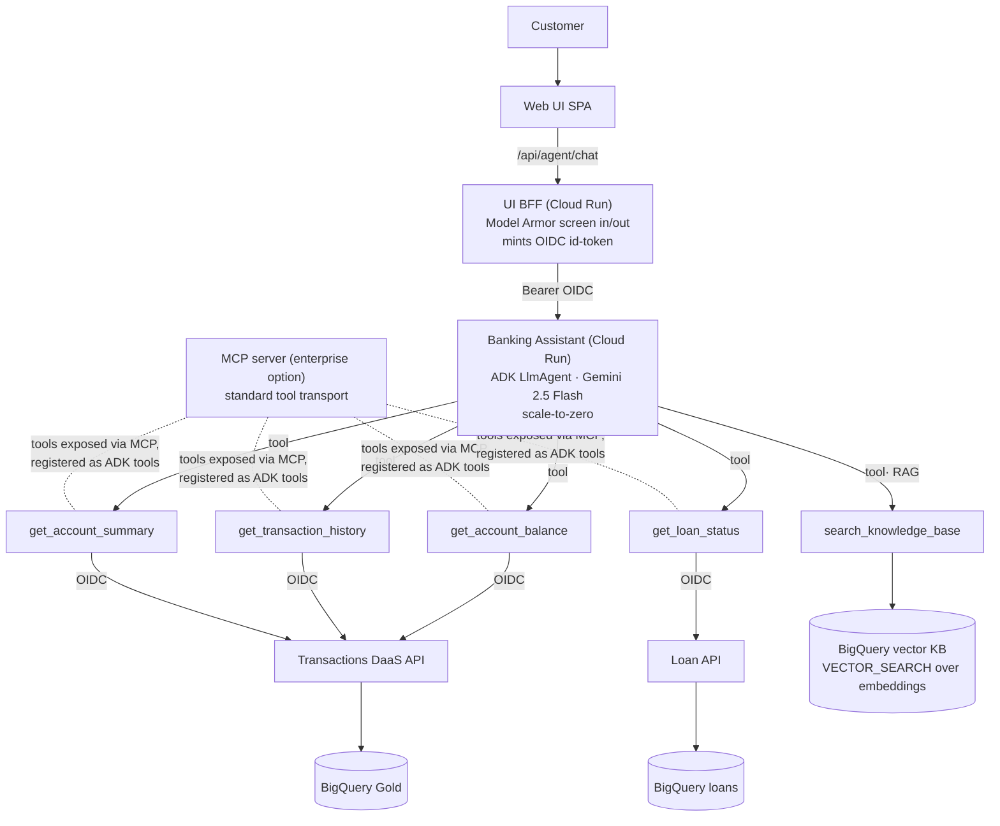
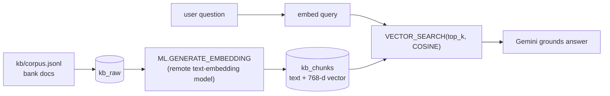
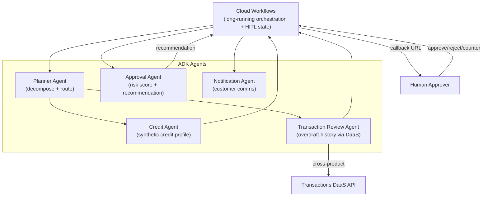

# 04 — Agent Architecture

> Agentic AI across both products. Authored in **Google ADK** (Gemini via Vertex AI). The
> conversational agent is **deployed on Cloud Run** for true scale-to-zero (~$0 idle) — Agent Engine
> was the original target but bills a per-engine baseline, so we use the portable Cloud Run path and
> keep the Agent Engine deploy as an option ([ADR-0004](adr/0004-agent-engine-vs-mcp.md),
> [ADR-0010](adr/0010-agents-on-cloud-run.md)). The multi-agent **loan** system is detailed below.

## Conversational data agent (Product 1) — Cloud Run + tools + RAG

> **MCP is in the target design as the tool-transport layer** (dashed, *not built*). Today the tools
> are in-process ADK functions calling the governed APIs directly; at enterprise scale the same tools
> are exposed by an **MCP server** and registered with the agent — standardizing tool access across
> teams/agents/vendors without changing the runtime. MCP is *complementary* to the Cloud Run/Agent
> Engine runtime, not a replacement for it ([ADR-0004](adr/0004-agent-engine-vs-mcp.md)).

- **Hosting:** Cloud Run, scale-to-zero. Same ADK agent also deployable to Agent Engine (`deploy.py`).
- **Structured grounding:** balance/history/summary tools call the governed **DaaS API** (the agent is
  just another consumer; no privileged data path). Tool calls + the BFF→agent hop use **OIDC** to reach
  private Cloud Run services.
- **Unstructured grounding (RAG):** `search_knowledge_base` runs **BigQuery `VECTOR_SEARCH`** over an
  embedded corpus of bank policies/terms/fees/branch info ([ADR-0009](adr/0009-bigquery-vector-rag.md)).
- **Runtime safety:** the UI BFF runs **Model Armor** on the prompt (in) and response (out) —
  prompt-injection/jailbreak, sensitive-data, malicious-URL, and harmful-content screening
  ([ADR-0008](adr/0008-model-armor-llm-screening.md)).
- **Guardrails:** the system instruction forbids fabricating financial data and blocks cross-customer
  access + advice; answers ground only in tool/RAG results.

### RAG pipeline (BigQuery vector)

Connection (CLOUD_RESOURCE) → `aiplatform.user`; the agent SA gets `dataViewer` + `connectionUser`.

## Loan multi-agent system (Product 2 — Increment 4)

### Agent roles

| Agent | Type | Responsibility |
|-------|------|----------------|
| Planner | Workflow/coordinator | Validate submission, decompose, route to specialist agents |
| Credit | Tool/data agent | Generate synthetic credit profile, persist to BigQuery |
| Transaction Review | Data agent | Pull transaction history + overdraft signals via DaaS (cross-product lineage) |
| Approval | Reasoning agent | Compute risk score, produce recommendation + rationale |
| Notification | Tool agent | Notify customer of decision |
| (Human) | HITL | Authenticated approve / reject / request-modification / counteroffer |

### State across long-running executions

- **Cloud Workflows execution** is the durable state machine: each step's output is persisted by the engine; the execution survives the multi-hour/day wait for human approval via a **callback endpoint** (`create_callback_endpoint` + `await_callback`).
- **Agent Engine managed sessions** hold conversational/agent context; **Memory Bank** can persist cross-session memory.
- **BigQuery** is the system-of-record: `loan_request`, `credit_profile`, `risk_assessment`, append-only `approval_decision` (versioned) + `loan_audit_log` — so the full decision history is reconstructable for audit regardless of in-flight engine state.

## Why Agent Engine (not just MCP)

MCP standardizes tool/data transport; Agent Engine governs how agents **run, remember, are evaluated,
and are operated** — sessions, tracing, eval harness, IAM, VPC-SC. See
[ADR-0004](adr/0004-agent-engine-vs-mcp.md). Tools may still be exposed over MCP and registered as ADK
tools.

## Evaluation

Grounding accuracy, hallucination rate, tool utilization, response quality, and (loan) approval
recommendation accuracy — datasets in [`eval/datasets/`](../eval/datasets/), framework in Increment 7.
