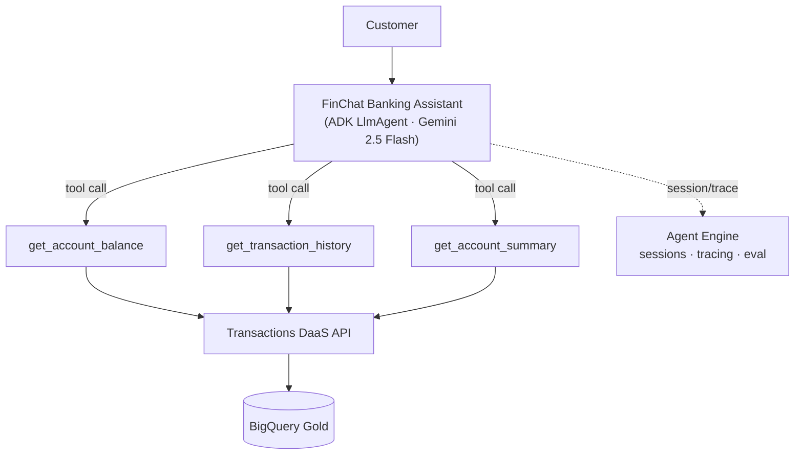
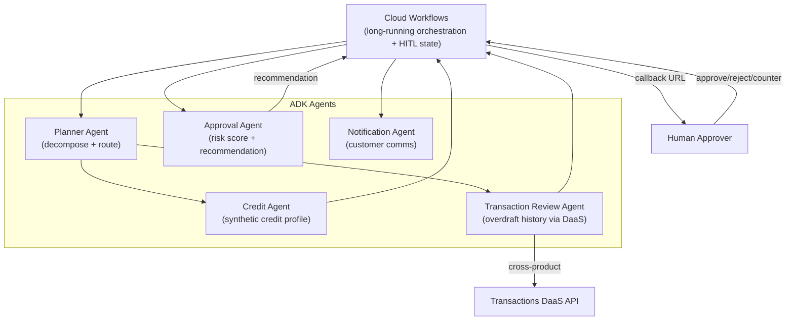

# 04 — Agent Architecture

> Agentic AI across both products. Authored in **Google ADK**, deployed to **Vertex AI Agent Engine**
> (managed sessions, tracing, eval) with Cloud Run as a portable fallback
> ([ADR-0004](adr/0004-agent-engine-vs-mcp.md)). The multi-agent **loan** system is detailed here and
> implemented in Increment 4; the **conversational data agent** is implemented in Increment 3.

## Conversational data agent (Product 1)

- **Grounding:** every answer derives from tool results over the governed data product; the system instruction forbids fabricating financial data and blocks cross-customer access + advice.
- **Tools = the DaaS API:** the agent is just another governed consumer (no privileged data path).
- **Runtime safety:** the UI BFF runs **Model Armor** on the prompt (in) and response (out) —
  prompt-injection/jailbreak, sensitive-data, malicious-URL, and harmful-content screening
  ([ADR-0008](adr/0008-model-armor-llm-screening.md)).

## Loan multi-agent system (Product 2 — Increment 4)

### Agent roles

| Agent | Type | Responsibility |
|-------|------|----------------|
| Planner | Workflow/coordinator | Validate submission, decompose, route to specialist agents |
| Credit | Tool/data agent | Generate synthetic credit profile, persist to BigQuery |
| Transaction Review | Data agent | Pull transaction history + overdraft signals via DaaS (cross-product lineage) |
| Approval | Reasoning agent | Compute risk score, produce recommendation + rationale |
| Notification | Tool agent | Notify customer of decision |
| (Human) | HITL | Authenticated approve / reject / request-modification / counteroffer |

### State across long-running executions

- **Cloud Workflows execution** is the durable state machine: each step's output is persisted by the engine; the execution survives the multi-hour/day wait for human approval via a **callback endpoint** (`create_callback_endpoint` + `await_callback`).
- **Agent Engine managed sessions** hold conversational/agent context; **Memory Bank** can persist cross-session memory.
- **BigQuery** is the system-of-record: `loan_request`, `credit_profile`, `risk_assessment`, append-only `approval_decision` (versioned) + `loan_audit_log` — so the full decision history is reconstructable for audit regardless of in-flight engine state.

## Why Agent Engine (not just MCP)

MCP standardizes tool/data transport; Agent Engine governs how agents **run, remember, are evaluated,
and are operated** — sessions, tracing, eval harness, IAM, VPC-SC. See
[ADR-0004](adr/0004-agent-engine-vs-mcp.md). Tools may still be exposed over MCP and registered as ADK
tools.

## Evaluation

Grounding accuracy, hallucination rate, tool utilization, response quality, and (loan) approval
recommendation accuracy — datasets in [`eval/datasets/`](../eval/datasets/), framework in Increment 7.
