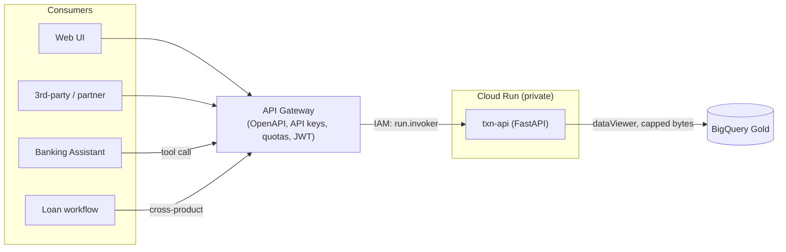

# 05 — API Architecture & OpenAPI

> API-first Data-as-a-Service. Contract-first OpenAPI drives both the gateway config and the agent's
> tool definitions. Sandbox uses **API Gateway**; the same contract imports into **Apigee X**
> ([ADR-0006](adr/0006-api-gateway-vs-apigee.md)).

## API topology

## Endpoints (Transactions DaaS)

| Operation | Method · Path | Backing source |
|-----------|---------------|----------------|
| Get Balance | `GET /v1/accounts/{id}/balance` | `gold.account_balance` |
| Get Transaction History | `GET /v1/accounts/{id}/transactions?limit=` | `silver.transaction` |
| Get Recent Activity | `GET /v1/accounts/{id}/activity?days=` | `silver.transaction` |
| Get Account Summary | `GET /v1/accounts/{id}/summary` | `gold.account_summary` |
| Health | `GET /healthz` | — |

- **OpenAPI 3** is auto-generated by FastAPI at `/openapi.json` (source of truth for clients/agent).
- **Swagger 2.0** gateway contract: [`products/transactions/api/openapi.gateway.yaml`](../products/transactions/api/openapi.gateway.yaml) (`x-google-backend` → Cloud Run).

## Design principles

- **Contract-first:** the OpenAPI doc is written/owned before/with the service; gateway + agent tools derive from it.
- **Versioned paths** (`/v1/...`) for non-breaking evolution.
- **Defense in depth:** auth at the gateway (keys/JWT/quota) *and* IAM at Cloud Run (private service, `run.invoker` only).
- **Cost & blast-radius guardrails:** `maximum_bytes_billed` on every query; read-only least-privilege SA scoped to Gold.
- **Serving from Gold only:** APIs never touch Silver/Bronze directly → governance + performance.

## Enterprise mapping (Apigee)

The gateway OpenAPI imports into Apigee X as an API proxy, adding: developer portal, monetization,
mediation/transformation policies, spike arrest, and deep analytics — no change to the backend
service or contract.
