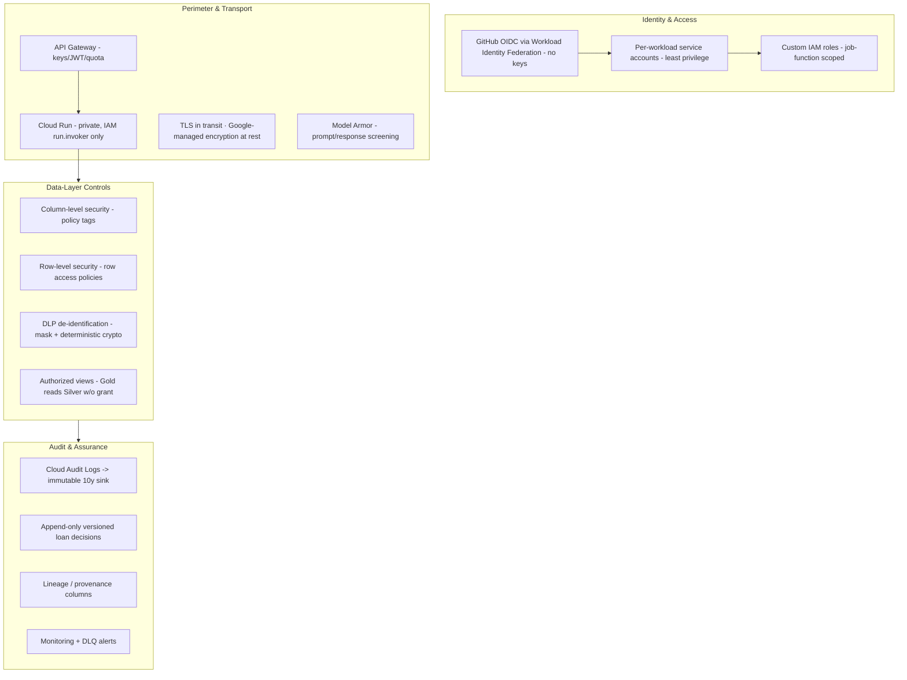

# 06 — Security Architecture

> Enterprise-banking security controls implemented across the platform, and how the design supports
> future regulatory requirements. Governance specifics: [09](09-data-governance.md).

## Controls by requirement

| Requirement | Implementation |
|-------------|----------------|
| **IAM design / least privilege** | One service account per workload; each bound only to the roles it needs ([foundation](../infra/modules/foundation/main.tf)); **custom roles** narrow to exact verbs ([iam](../infra/modules/iam/main.tf)) |
| **Service accounts** | Dedicated SAs for pipeline, txn-api, loan-api, agent, workflow, cicd; never the default SA |
| **Keyless CI/CD** | Workload Identity Federation — GitHub Actions impersonate the cicd SA, **no exported keys** |
| **Column-level security** | Data Catalog taxonomy + policy tags on `full_name`, `email`, `account_number`, `amount`, `counterparty_account`; only the privileged group is fine-grained reader |
| **Row-level security** | Row access policy on `silver.transaction` (e.g., posted-only / role-scoped) |
| **PII protection** | Cloud DLP inspect + de-identify (mask direct identifiers; deterministic crypto for SSN/card/IBAN with surrogate) before Silver |
| **LLM I/O screening** | **Model Armor** template screens agent prompts + responses for prompt injection/jailbreak, sensitive data, malicious URLs, harmful content; enforced in the UI BFF ([ADR-0008](adr/0008-model-armor-llm-screening.md)) |
| **Encryption** | Google-managed at rest (CMEK-ready: `kms_key` hooks in pipeline/Cloud Run), TLS in transit |
| **Network exposure** | Cloud Run services private (`--no-allow-unauthenticated`); access only via API Gateway / authorized SAs; UI is the only public surface |
| **Service-to-service auth** | The UI BFF and the agent mint **OIDC id-tokens** (audience = target service URL) to invoke **private** Cloud Run backends; caller SAs hold `run.invoker`. No keys, no public exposure of the agent/APIs |
| **Fine-grained CLS access** | Serving SAs that legitimately need a tagged column (DaaS API reads `PII_FINANCIAL`-tagged `amount`) are granted **`categoryFineGrainedReader` on that tag only**; `PII_DIRECT` stays restricted to the privileged group. CLS is enforced even through authorized views |
| **Auditability** | All `cloudaudit.googleapis.com` logs routed to an immutable 10-year logging bucket; loan decisions are append-only + versioned |
| **Data lineage** | `ingest_time`, `source_system`, `pipeline_version` columns + Pub/Sub message_id → Bronze → Silver → Gold chain |
| **Cost-as-control** | `maximum_bytes_billed` caps; budget alerts; scale-to-zero limits blast radius |

## Defense in depth

A request to read a balance crosses: UI persona → API Gateway (key/JWT/quota) → IAM (`run.invoker`)
→ Cloud Run service SA (`dataViewer` on Gold only, bytes capped) → BigQuery (CLS/RLS) → audit log.
A **chat** request additionally crosses **Model Armor** (prompt screened in, response screened out)
before/after the agent. No single control is the only line of defense.

## Supporting future regulatory requirements

- **Data residency:** single-region (`us-central1`) resources; region is a variable → multi-region or
  in-country deployment without redesign.
- **Right-to-be-forgotten / retention:** partition expiration + DLP tokenization (delete the key to
  crypto-shred); per-table retention policies already declared.
- **Auditable model decisions:** risk thresholds are explicit + versioned (`model_version`), decisions
  append-only — supports model-risk-management / explainability mandates (e.g., SR 11-7).
- **Segregation of duties:** distinct SAs + custom roles + GitHub Environment reviewers for promotion.
- **VPC Service Controls / CMEK:** the SA/least-privilege boundary and `kms_key` hooks make these an
  additive enablement, not a re-architecture.
