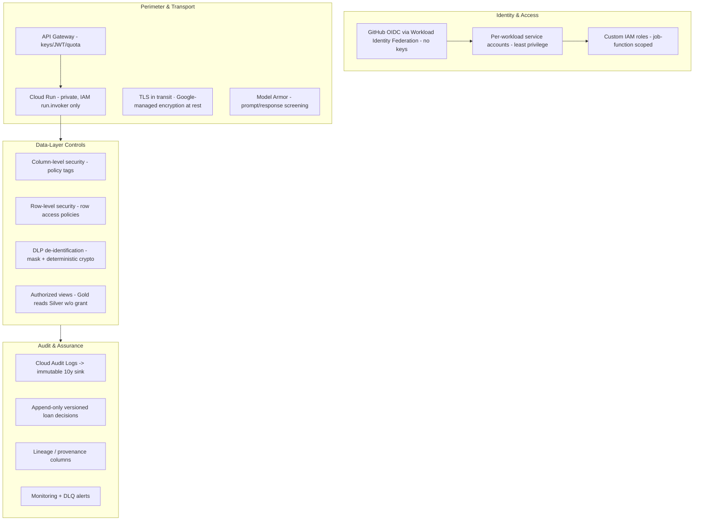

# 06 — Security Architecture

> Enterprise-banking security controls implemented across the platform, and how the design supports
> future regulatory requirements. Governance specifics: [09](09-data-governance.md).

```mermaid
flowchart TB
  subgraph identity["Identity & Access"]
    WIF[GitHub OIDC via Workload Identity Federation - no keys]
    SA[Per-workload service accounts - least privilege]
    CR[Custom IAM roles - job-function scoped]
  end
  subgraph perimeter["Perimeter & Transport"]
    GW[API Gateway - keys/JWT/quota]
    RUN[Cloud Run - private, IAM run.invoker only]
    TLS[TLS in transit · Google-managed encryption at rest]
    ARMOR[Model Armor - prompt/response screening]
  end
  subgraph data["Data-Layer Controls"]
    CLS[Column-level security - policy tags]
    RLS[Row-level security - row access policies]
    DLP[DLP de-identification - mask + deterministic crypto]
    AV[Authorized views - Gold reads Silver w/o grant]
  end
  subgraph assurance["Audit & Assurance"]
    AUDIT[Cloud Audit Logs -> immutable 10y sink]
    APPEND[Append-only versioned loan decisions]
    LINE[Lineage / provenance columns]
    MON[Monitoring + DLQ alerts]
  end
  WIF --> SA --> CR
  GW --> RUN --> data
  data --> assurance
```

## Controls by requirement

| Requirement | Implementation |
|-------------|----------------|
| **IAM design / least privilege** | One service account per workload; each bound only to the roles it needs ([foundation](../infra/modules/foundation/main.tf)); **custom roles** narrow to exact verbs ([iam](../infra/modules/iam/main.tf)) |
| **Service accounts** | Dedicated SAs for pipeline, txn-api, loan-api, agent, workflow, cicd; never the default SA |
| **Keyless CI/CD** | Workload Identity Federation — GitHub Actions impersonate the cicd SA, **no exported keys** |
| **Column-level security** | Data Catalog taxonomy + policy tags on `full_name`, `email`, `account_number`, `amount`, `counterparty_account`; only the privileged group is fine-grained reader |
| **Row-level security** | Row access policy on `silver.transaction` (e.g., posted-only / role-scoped) |
| **PII protection** | Cloud DLP inspect + de-identify (mask direct identifiers; deterministic crypto for SSN/card/IBAN with surrogate) before Silver |
| **LLM I/O screening** | **Model Armor** template screens agent prompts + responses for prompt injection/jailbreak, sensitive data, malicious URLs, harmful content; enforced in the UI BFF ([ADR-0008](adr/0008-model-armor-llm-screening.md)) |
| **Encryption** | Google-managed at rest (CMEK-ready: `kms_key` hooks in pipeline/Cloud Run), TLS in transit |
| **Network exposure** | Cloud Run services private (`--no-allow-unauthenticated`); access only via API Gateway / authorized SAs; UI is the only public surface |
| **Service-to-service auth** | The UI BFF and the agent mint **OIDC id-tokens** (audience = target service URL) to invoke **private** Cloud Run backends; caller SAs hold `run.invoker`. No keys, no public exposure of the agent/APIs |
| **Fine-grained CLS access** | Serving SAs that legitimately need a tagged column (DaaS API reads `PII_FINANCIAL`-tagged `amount`) are granted **`categoryFineGrainedReader` on that tag only**; `PII_DIRECT` stays restricted to the privileged group. CLS is enforced even through authorized views |
| **Auditability** | All `cloudaudit.googleapis.com` logs routed to an immutable 10-year logging bucket; loan decisions are append-only + versioned |
| **Data lineage** | `ingest_time`, `source_system`, `pipeline_version` columns + Pub/Sub message_id → Bronze → Silver → Gold chain |
| **Cost-as-control** | `maximum_bytes_billed` caps; budget alerts; scale-to-zero limits blast radius |

## Defense in depth

A request to read a balance crosses: UI persona → API Gateway (key/JWT/quota) → IAM (`run.invoker`)
→ Cloud Run service SA (`dataViewer` on Gold only, bytes capped) → BigQuery (CLS/RLS) → audit log.
A **chat** request additionally crosses **Model Armor** (prompt screened in, response screened out)
before/after the agent. No single control is the only line of defense.

## Workload identities, and the one that was wrong

Every FinChat service runs as its own least-privilege service account, and the ones added
for the agent channel hold **no project roles at all** — `mcp` and `mcp_auth` reach what
they need through per-target grants (`run.invoker` on a named service, `secretAccessor` on
two named secrets) rather than project-wide roles. That is the intended shape, and it is
worth stating because the project contained a live counter-example for months.

**`roles/owner` on the default compute service account** (removed 2026-09-08). Several
workloads outside FinChat ran as it, including an internet-facing UI, and the grant was
invisible precisely because nothing ever used the extra reach: the account already held
`roles/editor` plus around twenty specific roles, so everything worked identically without
owner. What owner added was the power to rewrite the project's IAM policy — the one
capability a workload should never have, since it converts any code execution into
permanent, self-granted privilege.

Two things made the removal safe to reason about rather than a leap:

- **Audit logs, not intuition.** Ninety days showed no `SetIamPolicy`, no billing calls,
  and no resource-manager writes by that principal. The capability being withdrawn had
  never been exercised.
- **The remaining 24 roles were enumerated first.** `cloudbuild.builds.builder`,
  `run.admin`, `storage.admin` and `artifactregistry.writer` are what `gcloud run deploy
  --source` actually needs; all were retained.

The related fix is in the AI gateway ([ADR-0020](adr/0020-remote-mcp-workspace-federation.md)
consumes it): its public UI and its private API now have separate identities, so a
compromise of the internet-facing container does not inherit the backend's reach. Both ran
as that same default account until the same day.

**The general rule this leaves behind:** a default service account is a shared identity,
and any grant on it is a grant to every workload that has ever defaulted to it. Name the
identity per workload, and the blast radius becomes something you can read off the IAM
policy instead of having to reconstruct.

## Supporting future regulatory requirements

- **Data residency:** single-region (`us-central1`) resources; region is a variable → multi-region or
  in-country deployment without redesign.
- **Right-to-be-forgotten / retention:** partition expiration + DLP tokenization (delete the key to
  crypto-shred); per-table retention policies already declared.
- **Auditable model decisions:** risk thresholds are explicit + versioned (`model_version`), decisions
  append-only — supports model-risk-management / explainability mandates (SR 26-2 / OCC 2026-13 for
  the deterministic scorecard; FinChat's own control framework for the generative models the revised
  guidance excludes — see [19 — Model & Agent Inventory](19-model-inventory.md)).
- **Segregation of duties:** distinct SAs + custom roles + GitHub Environment reviewers for promotion.
- **VPC Service Controls / CMEK:** the SA/least-privilege boundary and `kms_key` hooks make these an
  additive enablement, not a re-architecture.
