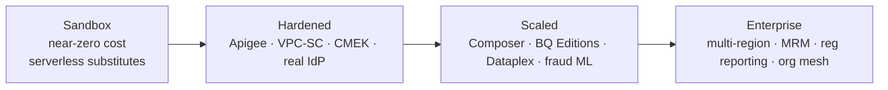

# 11 — Future-State Enterprise Roadmap

> How the near-zero-cost sandbox evolves into a full Fortune-500 banking platform. Each item is
> **additive** — the substitution strategy ([ADR-0002](adr/0002-serverless-substitution-strategy.md))
> ensures migration is configuration, not re-architecture.

## Horizon 1 (0–3 months) — Harden the reference

| Theme | Action |
|-------|--------|
| API management | Import the OpenAPI contracts into **Apigee X**; add developer portal, spike-arrest, analytics |
| Streaming | Flip `enable_streaming_job=true` → 24/7 Dataflow w/ Streaming Engine + autoscaling |
| Agents | Warm Agent Engine min-instances for latency SLOs; enable Memory Bank |
| Security | Turn on **VPC Service Controls** perimeter + **CMEK** (hooks already present) |
| Identity | Replace persona simulation with **IAP / Cloud Identity / external IdP (OIDC/SAML)** + real RBAC |
| Quality gate | Branch protection + required CI + signed commits + `terraform plan` PR comments |

## Horizon 2 (3–9 months) — Scale & enrich

| Theme | Action |
|-------|--------|
| Batch orchestration | Introduce **Cloud Composer** for nightly reconciliation, regulatory batch, dbt, ML retraining (complements Workflows) |
| Slots & cost | BigQuery **Editions** with reservations + autoscaling slots; per-product cost attribution |
| Real bureau data | Replace synthetic credit with a bureau integration behind the Credit Agent's tool contract |
| More data products | Cards, payments, fraud, KYC as additional mesh products sharing the governance plane |
| Lineage at scale | Full **Dataplex** lakes/zones + automated lineage + data-quality tasks |
| Fraud / streaming ML | Real-time scoring in the Beam pipeline; feature store (Vertex) |

## Horizon 3 (9–18 months) — Enterprise & regulatory

| Theme | Action |
|-------|--------|
| Multi-region / DR | Regional → multi-region BigQuery, cross-region replication, tested RTO/RPO |
| Model risk mgmt | Formal model registry, challenger models, bias/fairness monitoring (SR 11-7) |
| Regulatory reporting | Automated BCBS 239 reconcilable reporting; evidence packs from the audit sink |
| Org-wide mesh | Self-service data-product templates, central policy-as-code (Org Policy + OPA) |
| FinOps | Chargeback/showback, committed-use discounts, anomaly-based budget automation |
| Resilience | Chaos/DR drills, multi-cloud gateway via Apigee hybrid (optionality) |

## Capability maturity

## Guiding principle

The sandbox already encodes the **target architecture's contracts** (medallion layering, OpenAPI DaaS,
event backbone, agent patterns, IaC, governance taxonomy). The roadmap swaps **implementations behind
those contracts** and raises capacity/assurance — never rewrites the architecture.
