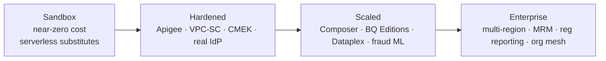

# 11 — Future-State Enterprise Roadmap

> How the near-zero-cost sandbox evolves into a full Fortune-500 banking platform. Each item is
> **additive** — the substitution strategy ([ADR-0002](adr/0002-serverless-substitution-strategy.md))
> ensures migration is configuration, not re-architecture.

## Horizon 1 (0–3 months) — Harden the reference

| Theme | Action |
|-------|--------|
| API management | Import the OpenAPI contracts into **Apigee X**; add developer portal, spike-arrest, analytics |
| Streaming | Flip `enable_streaming_job=true` → 24/7 Dataflow w/ Streaming Engine + autoscaling |
| Agents | Warm Agent Engine min-instances for latency SLOs; enable Memory Bank |
| Security | ✅ **Model Armor** screening on the agent (done); turn on **VPC Service Controls** perimeter + **CMEK** (hooks present); enable the Model Armor **floor setting** org-wide |
| Identity | ✅ **Identity-resolved personas** (Google Sign-In + BFF-verified RBAC, [ADR-0016](adr/0016-identity-resolved-personas.md)); enterprise: **IAP** on the staff surface + **Identity Platform** (CIAM) for customers + workforce IdP federation (Entra/Okta) |
| Quality gate | Branch protection + required CI + signed commits + `terraform plan` PR comments |

## Horizon 2 (3–9 months) — Scale & enrich

| Theme | Action |
|-------|--------|
| Batch orchestration | Introduce **Cloud Composer** for nightly reconciliation, regulatory batch, dbt, ML retraining (complements Workflows) |
| Slots & cost | BigQuery **Editions** with reservations + autoscaling slots; per-product cost attribution |
| Real bureau data | Replace synthetic credit with a bureau integration behind the Credit Agent's tool contract |
| Agent tooling | Expose the agent tools via an **MCP server** (standard tool transport) registered with the ADK agents — shareable across teams/agents/vendors (ADR-0004) |
| More data products | Cards, payments, fraud, KYC as additional mesh products sharing the governance plane |
| Lineage at scale | Full **Dataplex** lakes/zones + automated lineage + data-quality tasks |
| Fraud / streaming ML | Real-time scoring in the Beam pipeline; feature store (Vertex) |

## Horizon 3 (9–18 months) — Enterprise & regulatory

| Theme | Action |
|-------|--------|
| Multi-region / DR | Regional → multi-region BigQuery, cross-region replication, tested RTO/RPO |
| Model risk mgmt | Formal model registry, challenger models, bias/fairness monitoring (SR 11-7) |
| Regulatory reporting | Automated BCBS 239 reconcilable reporting; evidence packs from the audit sink |
| Org-wide mesh | Self-service data-product templates, central policy-as-code (Org Policy + OPA) |
| FinOps | Chargeback/showback, committed-use discounts, anomaly-based budget automation |
| Resilience | Chaos/DR drills, multi-cloud gateway via Apigee hybrid (optionality) |

## Performance & latency levers (enterprise tier)

What gets *faster* at enterprise scale, mapped from what the sandbox measured. Two were
already applied in the sandbox after live measurement; the rest are configuration-not-
rearchitecture upgrades.

| Lever | Sandbox today (measured) | Enterprise upgrade |
|---|---|---|
| **Vector index on the KB** | `VECTOR_SEARCH` over `kb_chunks` is **brute force — exact and instant at 22 chunks**. BigQuery enforces a **5,000-row minimum** for vector indexes (verified: `CREATE VECTOR INDEX` is rejected below it), so an index is *wrong* at demo scale. | At corpus scale, create the ANN index — sub-linear search over millions of chunks: `CREATE VECTOR INDEX kb_idx ON kb.kb_chunks(embedding) OPTIONS(index_type="IVF", distance_type="COSINE")` (or `TREE_AH` for larger corpora + `stored_columns` to cover citation fields). Monitor recall vs latency via `INFORMATION_SCHEMA.VECTOR_INDEXES`. |
| **Write path** | ✅ Applied: loan submit was **37s** from ~10 serial BigQuery *load jobs*; switching append-only tables to **streaming inserts** → **5.5–9s**. | **Storage Write API** (exactly-once, higher throughput) for all OLTP-ish writes; Pub/Sub BigQuery subscriptions already use it for Bronze. |
| **Serving rollups** | `customer_360` & gold views are logical — recomputed per query (fine at 7.5k customers). | **Materialized views / scheduled refresh** for hot rollups + **BI Engine** in-memory acceleration for the DaaS/serving queries and BI dashboards. |
| **Query latency floor** | On-demand slots — variable queueing. | **BigQuery Editions reservations** (+ autoscaling) give consistent slot capacity → predictable P95 for DaaS and Conversational Analytics SQL. |
| **Cold starts** | ✅ Applied at $0: **startup CPU boost** on all services (extra CPU during startup only) and the BFF's HTTP clients pooled into one **keep-alive client** (saves a TLS handshake per backend hop, every request). Scale-to-zero still pays a first-hit penalty. | `min-instances ≥ 1` (the `run_min_instances` Terraform variable already exists) removes the cold start entirely — ~$5–10/mo per service, the one lever here that costs money. |
| **Gemini latency** | On-demand Gemini Flash; Conversational Analytics is inherently multi-step (plan → SQL → execute → compose, ~10–25s). | **Provisioned Throughput** for latency SLOs on Vertex; **context caching** for the long system instructions (graph join model, agent persona); **response streaming** to the UI for perceived latency; model tiering (Flash-Lite for routing, Flash for tools, Pro for synthesis). |
| **Edge** | SPA served by the BFF container. | Fronting with the HTTPS LB (required for IAP anyway) adds **Cloud CDN** for static assets free of refactoring. |

> Principle, same as everywhere else in this roadmap: the sandbox keeps the *contract*
> (`VECTOR_SEARCH` TVF, the views' schemas, the Cloud Run services) and the enterprise tier
> swaps the implementation behind it — an indexed `VECTOR_SEARCH` call is the *same SQL*.

## Knowledge-base corpus & embedding lifecycle (enterprise tier)

**Nothing about the RAG corpus refreshes automatically today, by design.** The embedding
model (`finchat_kb_<env>.embedding_model`) is a BigQuery **remote model** — a static pointer
to Vertex `text-embedding-005`; it holds no corpus state and adding documents has no effect on
it. The vectors live in the materialized `kb_chunks` table, generated by a **one-time batch**
(`bq load --replace` into `kb_raw` → `CREATE OR REPLACE TABLE kb_chunks AS … ML.GENERATE_EMBEDDING`,
see `products/transactions/agent/kb/setup_rag.sh`). New documents have **no embeddings until that
step is re-run** — there is no on-insert embedding trigger in BigQuery. The enterprise tier turns
that manual full-rebuild into an orchestrated, incremental pipeline:

| Stage | Sandbox today | Enterprise upgrade |
|---|---|---|
| **Source & trigger** | Hand-edited `kb/corpus.jsonl`, re-run by hand. | Documents land in **GCS** (synced from the system of record — Confluence/SharePoint/DMS). **Eventarc** on object-finalize (or Pub/Sub) fires the pipeline; **Cloud Composer (Airflow)** runs the scheduled/backfill DAG. The blog publish API's `→ /ingest` webhook is the seed of this pattern. |
| **Parse & chunk** | One row per doc, whole-document content. | **Document AI** for PDFs/scans (OCR + layout), then semantic **chunking with overlap** + metadata extraction — retrieval quality is mostly won or lost here, not in the model. |
| **Embedding refresh** | Full `CREATE OR REPLACE TABLE` re-embeds the *entire* corpus every run. | **Incremental**: content-hash CDC on `doc_id`, `MERGE`/`INSERT` only changed/new chunks (`WHERE doc_id NOT IN (SELECT doc_id FROM kb_chunks)` or hash mismatch). Same `ML.GENERATE_EMBEDDING` call, a fraction of the cost and time. |
| **Vector store** | BigQuery `kb_chunks`, brute-force `VECTOR_SEARCH` (exact, instant at 22 chunks). | Stay in BigQuery + an ANN **`VECTOR INDEX`** (IVF/TREE_AH) for millions of chunks (see the lever above); *or* **Vertex AI Vector Search** (Matching Engine) when sub-50 ms ANN at very high QPS is the requirement; *or* **AlloyDB / pgvector** when retrieval must sit next to transactional data. The `search_knowledge_base` tool contract is unchanged either way. |
| **Model-version change** | Edit the `ENDPOINT` and rebuild. | Changing the embedding model forces a **full re-embed** — vectors from different models aren't comparable. Do it as a **blue/green** build into a new table/index and swap atomically (no half-embedded corpus serving queries). Pin the model version explicitly; treat an upgrade as a deliberate, evaluated migration. |
| **Governance** | KB is a normal BigQuery dataset (IAM, audit, lineage). | **Document-level ACLs / row-level security** on `kb_chunks` so retrieval respects who-may-see-which-doc; corpus **versioning** + freshness SLA; **Dataplex** lineage from source doc → chunk → embedding. |
| **Retrieval quality** | Manual smoke test (`VECTOR_SEARCH` for "overdraft fees"). | **recall@k / citation-precision evals** wired into the live-eval loop ([ADR-0015](adr/0015-live-evaluation.md), [ADR-0009](adr/0009-bigquery-vector-rag.md)) — every corpus or model change is regression-tested for retrieval drift, not just answer quality. |

> Same principle: the **`search_knowledge_base` + `VECTOR_SEARCH` contract is preserved**; the
> enterprise tier swaps a manual full rebuild for an event-driven, incremental, governed
> re-embedding pipeline behind it. The model never "auto-updates" — re-embedding is always an
> explicit, orchestrated, version-pinned step.

## Capability maturity

## Guiding principle

The sandbox already encodes the **target architecture's contracts** (medallion layering, OpenAPI DaaS,
event backbone, agent patterns, IaC, governance taxonomy). The roadmap swaps **implementations behind
those contracts** and raises capacity/assurance — never rewrites the architecture.
