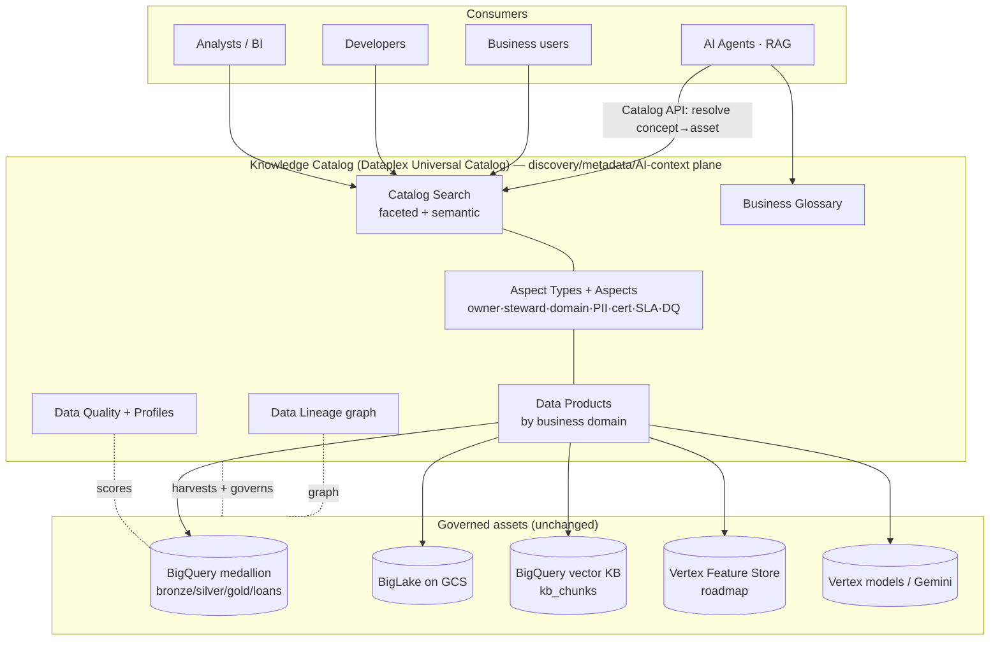
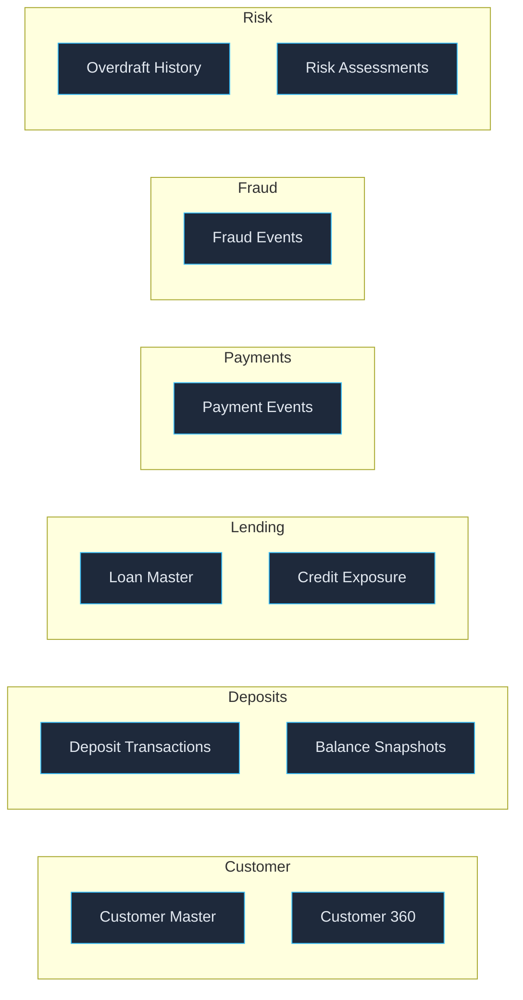
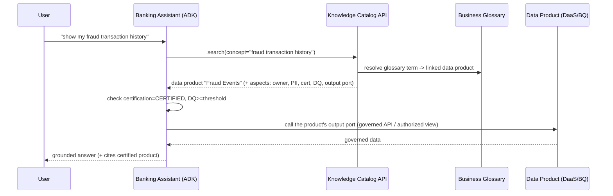
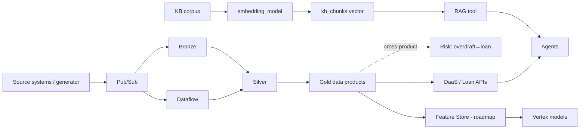
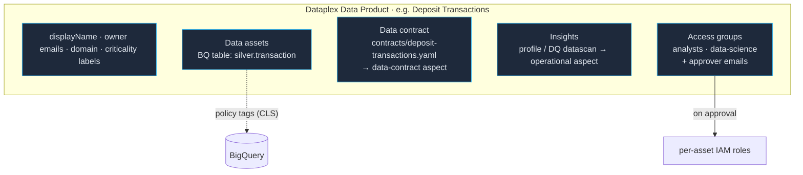
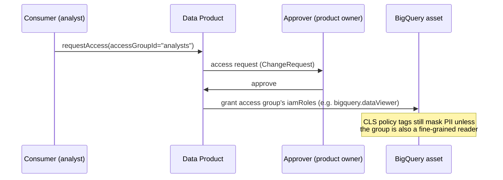

# 12 — Knowledge Catalog (Dataplex Universal Catalog) Enhancement

> **Scope.** Make Google Cloud **Dataplex Universal Catalog** (the evolution of Data Catalog —
> "Knowledge Catalog") the **primary enterprise discovery, metadata, governance, and AI-context
> layer** across FinChat's data, analytics, and AI assets — **augmenting**, not redesigning, the
> existing architecture (BigQuery + BigLake lakehouse, medallion, data-mesh data products, Vertex AI
> agents, BigQuery-vector RAG, and the current governance controls).
>
> _Terminology:_ Google has consolidated **Data Catalog → Dataplex Catalog → Dataplex Universal
> Catalog**. We use **"Knowledge Catalog" / "the Catalog"** for the product; concrete resources are
> Dataplex **Aspects/Aspect Types, Entries/Entry Groups, Business Glossary, Data Scans (DQ/profile),
> Data Lineage**, and **catalog search**. FinChat already uses the legacy Data Catalog **taxonomy +
> policy tags** for column-level security — that is preserved and *linked* into the new model.

## 0. What already aligns (preserve as-is)

| Existing control | Keep | Catalog augmentation |
|---|---|---|
| BigQuery + BigLake medallion (`bronze/silver/gold`, `loans`, `kb`) | ✅ | Catalog **auto-harvests** these as entries; no change to storage |
| Policy tags (PII_DIRECT / PII_FINANCIAL / CONFIDENTIAL) + RLS | ✅ | Surface classification + policy metadata as **aspects**; link to **glossary** |
| Inline lineage columns (`ingest_time`, `source_system`, `pipeline_version`) | ✅ | Complement with the **Data Lineage API** graph |
| DLP de-id, audit sink, least-privilege IAM | ✅ | Expose certification/policy status via aspects |
| Data-as-a-Product (Transactions, Loans) | ✅ | Promote to first-class **catalog data products** under business **domains** |
| RAG (BigQuery `VECTOR_SEARCH` over `kb_chunks`) | ✅ | Register vector index + corpus as discoverable AI assets |

The enhancement is **a metadata/discovery overlay** — zero change to physical data, pipelines, or the
serving APIs.

---

## 1. Recommended Knowledge Catalog enhancements (summary)

1. **Catalog as the single discovery plane** — one searchable index over BigQuery datasets/tables/views,
   BigLake tables, Vertex models, the RAG vector index, DQ scores, and lineage.
2. **Business-domain + data-product organization** — entries organized by **domain → data product**,
   not by project/dataset, via **Entry Groups** + a **Data Product aspect**.
3. **Rich, governed metadata model** — **Aspect Types** for product/governance/operational metadata
   (owner, steward, domain, criticality, PII class, certification, SLA, source systems, cost center,
   DQ score) + a **Business Glossary** of authoritative banking terms.
4. **AI context layer** — agents resolve **business concepts → physical assets** via the Catalog API
   (search + aspects + glossary), instead of hard-coding table names.
5. **Governance surfaced in-catalog** — classification, certification, policy, and DQ are visible at
   discovery time, driving trust + self-service.
6. **End-to-end lineage** — source → ingestion → BigQuery → data products → feature store → vector
   repo → RAG → models, via the Data Lineage API + custom lineage events.

---

## 2. Updated logical architecture



The Catalog sits **above** the lakehouse as a governance/discovery overlay; agents and humans enter
through it and are routed to the right governed asset.

---

## 3. Updated metadata model

Implemented with native **Aspect Types** (structured, validated metadata templates — the modern
replacement for Data Catalog tag templates) attached to **entries** (datasets, tables, views, columns,
data products, models, vector indexes).

### 3.1 Aspect Types

| Aspect Type | Attached to | Fields |
|---|---|---|
| `finchat-data-product` | data-product entry | product_name, business_domain, product_owner, steward, criticality (`CRITICAL\|HIGH\|MEDIUM\|LOW`), certification_status (`CERTIFIED\|CANDIDATE\|DEPRECATED`), sla (freshness/availability), source_systems[], cost_center, output_ports[] |
| `finchat-governance` | dataset/table/column | pii_classification (`PII_DIRECT\|PII_FINANCIAL\|CONFIDENTIAL\|INTERNAL\|PUBLIC`), policy_tag_ref, retention, encryption (CMEK/Google-managed), residency, lawful_basis |
| `finchat-operational` | table/view | data_quality_score (0–100 or profile row count), last_dq_run, freshness_sla, owner_oncall, pipeline_version, change_ticket |
| `finchat-data-contract` | data-product entry | contract_version (semver), status (`ACTIVE\|CANDIDATE\|DEPRECATED`), freshness_sla, availability_sla, guarantees, deprecation_policy, contract_ref (→ `contracts/<id>.yaml`) |
| `finchat-ai-asset` | model / vector index / corpus | asset_kind (`vector_index\|embedding_model\|feature_view\|agent_tool`), embedding_model, dims, grounding_for[], eval_dataset, last_eval_scores |

> All five aspect types are created in the **`global`** location (BigQuery catalog
> entries live in the `us` multi-region; a regional aspect type is rejected as "not
> usable by entries in region 'us'"). See `infra/modules/catalog`.

> The existing **policy tags drive enforcement** (column-level security); the `finchat-governance`
> aspect **describes** the same classification for *discovery* and links to the policy tag — one source
> of truth, two surfaces (enforcement + discovery).

### 3.2 Required metadata coverage (your list → where it lives)

| Metadata | Aspect Type · field |
|---|---|
| Product Owner / Steward | `finchat-data-product.product_owner` / `.steward` |
| Business Domain | `finchat-data-product.business_domain` (+ Entry Group) |
| Criticality | `finchat-data-product.criticality` |
| PII Classification | `finchat-governance.pii_classification` (+ policy tag) |
| Certification Status | `finchat-data-product.certification_status` |
| SLA | `finchat-data-product.sla` / `finchat-operational.freshness_sla` |
| Source Systems | `finchat-data-product.source_systems[]` |
| Cost Center | `finchat-data-product.cost_center` |
| Data Quality Score | `finchat-operational.data_quality_score` (auto from Data Scan) |

---

## 4. Data Product hierarchy

Organize the Catalog by **business domain → data product**, surfaced via **Entry Groups** (one per
domain) and the `finchat-data-product` aspect (so search/browse is business-shaped, not storage-shaped).



### FinChat sandbox → catalog mapping (what's built today)

| Domain | Data product | Backing assets (built) | Output ports |
|---|---|---|---|
| Deposits | **Deposit Transactions** | `silver.transaction`, `gold.account_summary/account_balance` | DaaS API, agent tool |
| Customer | **Customer Master** | `silver.customer` (seeded), `silver.account` | DaaS API |
| Risk | **Overdraft History** | `gold.overdraft_history` | cross-product → Loans |
| Lending | **Loan Master / Credit Exposure** | `loans.loan_request/risk_assessment/loan_status` | Loan API, agent tool |
| AI | **Bank Knowledge Base** | `kb.kb_chunks` (vector), `kb.embedding_model` | RAG / `search_knowledge_base` |

Domains **Payments / Fraud / Treasury / Marketing** are modeled as the **enterprise target** (empty
Entry Groups + glossary terms now; populated as those data products are built) — consistent with the
near-zero-cost dual-tier approach.

> Sharing/exchange at enterprise scale uses **Analytics Hub** (publish certified data products as
> listings to consumer domains) — additive, no change to producers.

---

## 5. AI discovery & semantic search architecture

The Catalog becomes the **semantic layer for AI**: agents discover data by **business concept**, never
by physical table name.



### New ADK tool: `discover_data_product(concept)`

A catalog-backed tool added to the agents:

1. **Semantic search** the Catalog for the business concept (search API + glossary synonyms).
2. Return the **certified** data product's metadata: business name, owner, **PII class**, **certification
   status**, **DQ score**, and **output port** (the API/authorized view to call).
3. The agent **gates** on metadata (only consume `CERTIFIED` products above a DQ threshold) and calls
   the resolved output port — *grounding moves from hard-coded endpoints to catalog-resolved contracts.*

How catalog metadata supports the AI workloads:

| Need | Catalog mechanism |
|---|---|
| **Agent discovery** | Catalog search + glossary resolves concept → data product |
| **Context enrichment** | Aspects supply owner/SLA/PII/cert/DQ so the agent reasons about *trust*, not just data |
| **RAG** | `kb_chunks` (vector index) + `embedding_model` registered as `finchat-ai-asset` entries → discoverable, lineage-tracked, governed corpora; new corpora are *found*, not hard-wired |
| **Agent↔data-product** | Agents bind to **output ports** declared in the data-product aspect (decoupled from physical tables) |
| **Semantic search** | Glossary terms + synonyms + descriptions power natural-language lookup |
| **Enterprise knowledge retrieval** | Single API across structured (BQ), unstructured (RAG corpora), and AI assets |

---

## 6. Governance enhancements (surfaced in-catalog)

- **Classification at discovery time:** `finchat-governance` aspect shows PII class on every entry/column,
  linked to the enforcing **policy tag** — users see sensitivity *before* requesting access.
- **Certification workflow:** `certification_status` aspect (`CANDIDATE → CERTIFIED → DEPRECATED`) with
  steward sign-off; only `CERTIFIED` products are recommended to agents/analysts.
- **Policy metadata:** retention, residency, encryption (CMEK-ready), lawful basis as governance-aspect
  fields → auditable, queryable governance posture.
- **Access governance:** Dataplex/IAM continues to gate; the Catalog adds **request-to-access** context
  (who owns it, why it's restricted) and ties to the existing least-privilege + RLS/CLS model.
- **Compliance evidence:** the catalog + audit sink together provide BCBS 239 / GLBA / SOX evidence
  (provenance, ownership, classification, certification) without new pipelines.

---

## 7. Data Quality integration

Use **Dataplex Data Scans** (Auto Data Quality + Data Profiling) — no app code:

- **Profile scans** on `silver.*` / `gold.*` (and `loans.*`) for distributions, null %, uniqueness.
- **Quality scans** with rules per data product (e.g., `amount >= 0`, `status IN (...)`, idempotency-key
  uniqueness, FK presence after the dimension seed) → a **0–100 score**.
- **Publish to Catalog:** scan results write the `data_quality_score` + `last_dq_run` onto the
  `finchat-operational` aspect, so DQ is visible at discovery and **gated by agents** (`discover_data_product`
  refuses low-quality products).
- Complements the **in-stream** validation/DLQ already in the Beam pipeline (shift-left + at-rest scans).

---

## 8. Lineage integration

Extend the existing inline-column lineage with the **Data Lineage API** (automatic for BigQuery & Dataflow;
custom events for the rest), unified in the Catalog:



Coverage: **source → ingestion (Pub/Sub, Dataflow) → BigQuery (bronze→silver→gold) → data products →
feature store → vector repo → RAG pipeline → models/agents.** Auto-captured links from BQ/Dataflow;
**custom lineage events** (Lineage API) stitch in the generator, the RAG embedding step, and
agent-to-product reads — giving regulators end-to-end provenance for any figure or model decision.

---

## 9. Built today — Data Products, Contracts, Insights & Access Groups

Beyond the catalog *overlay* (aspects on BigQuery entries), FinChat publishes each
of the 5 products as a **first-class Dataplex Data Product** — the curated, owned,
consumable package shown on the console **Data products** page. A data product is
*more* than a table: it bundles **assets**, a **contract**, **insights**, and an
**access model** consumers request against.



### 9.1 The four facets, per product

| Facet | What it is | Where it lives | How it's set |
|---|---|---|---|
| **Aspects** | Governed metadata on the catalog entry | `data-product`, `governance`, `data-contract`, `operational` aspects | `scripts/catalog_bootstrap.py` |
| **Contracts** | Producer's versioned promise (schema, quality, SLA, access, lineage) | `contracts/<id>.yaml` (code) + `data-contract` aspect summary | authored in repo; published by bootstrap |
| **Insights** | Profiling / data-quality results | Dataplex **data-profile** scan per product (+ detailed **quality** scan for Deposit Transactions) → `operational` aspect | `infra/modules/catalog` datascans + `run_datascans.sh` + bootstrap |
| **Access groups** | Consumer personas that can **request access** (approval-gated) + per-asset IAM granted on approval | Data Product `accessGroups` + `accessApprovalConfig`; asset `accessGroupConfigs` | `scripts/data_products.py` |

Per-product values are a **single source of truth** in
[`scripts/products_catalog.py`](../scripts/products_catalog.py), imported by both
bootstrap scripts so contract/aspect/data-product metadata can never drift.

### 9.2 Access request & approval flow

Consumers don't get blanket access — each product declares **access groups** (a
consumer persona bound to a Google group) and **approver emails**. A consumer
issues a *request access*; the approver grants it; the access group's IAM roles
are then applied to the product's assets.



> **Demo vs enterprise:** the access-group *definitions* + approver config are
> created here. Binding the IAM on approval requires the principals to be **real
> Cloud Identity groups**; with placeholder groups it is deferred (run
> `FINCHAT_BIND_ASSET_IAM=1 python scripts/data_products.py <env>` once the groups
> exist). Column-level security (policy tags) is enforced independently regardless.

### 9.3 Live prod state

| Data product | Asset | Contract | Insight (latest scan) | Access groups |
|---|---|---|---|---|
| Deposit Transactions | `silver.transaction` | v1.2.0 ACTIVE | **100% PASS** (quality) | analysts, data-science |
| Customer Master | `silver.customer` | v2.0.0 ACTIVE | 7,500 rows (profile) | crm, data-science |
| Overdraft History | `gold.overdraft_history` | v1.0.1 ACTIVE | 7,500 rows (profile) | risk-analysts, collections |
| Loan Master | `loans.loan_status` | v0.9.0 CANDIDATE | 0 rows (profile) | underwriting, risk-analysts |
| Bank Knowledge Base | `kb.kb_chunks` | v1.1.0 ACTIVE | 22 rows (profile) | ai-platform, support |

### 9.4 Operate it (per env)

```bash
# 1. Infra (aspect types, entry groups, datascans, scan-SA fine-grained reader)
cd infra/envs/<env> && terraform apply        # requires enable_catalog = true

# 2. Run the profile/quality scans (Insights)
./scripts/run_datascans.sh <env>

# 3. Glossary + aspects (data-product, governance, data-contract) + publish insights
python scripts/catalog_bootstrap.py <env>

# 4. Data Products: products + assets + access groups + approval
python scripts/data_products.py <env>
#    (real groups: FINCHAT_BIND_ASSET_IAM=1 python scripts/data_products.py <env>)
```

> **API note.** The Data Products surface is a **preview REST API**
> (`dataplex.googleapis.com/v1/.../dataProducts`) — no `gcloud` group or Terraform
> resource exists yet, so `scripts/data_products.py` drives it directly (idempotent,
> polls LROs, 429 backoff). Datasets must be **co-located** with the product
> (`us-central1`); the loans dataset is now Terraform-managed for exactly this
> reason (see ADR-0011 / the deployment runbook).

---

## 10. Prioritized implementation roadmap

| Phase | Effort | Enhancement | Outcome |
|---|---|---|---|
| **P0 (days)** | low | Enable Dataplex Universal Catalog; auto-harvest BQ; create domain **Entry Groups**; define **Aspect Types**; tag the 5 built products with `finchat-data-product` aspects | Business-shaped discovery; metadata model live |
| **P1 (1–2 wk)** | low-med | **Business Glossary** (authoritative banking terms + synonyms) linked to data products/columns; link governance aspects to existing **policy tags** | Semantic search + classification-at-discovery |
| **P2 (1–2 wk)** | med | **Data Scans** (profile + quality) on silver/gold/loans → publish DQ score to aspects | Trust signals; DQ-gated consumption |
| **P3 (1–2 wk)** | med | **Data Lineage API** + custom events for generator/RAG/agent reads | End-to-end provenance |
| **P4 (2–3 wk)** | med | **`discover_data_product` ADK tool** → agents resolve concept→product via Catalog; gate on cert + DQ | AI semantic layer; agents bind to output ports |
| **P5 (enterprise)** | med | **Analytics Hub** listings for certified products; populate Payments/Fraud/Treasury/Marketing domains; **Vertex Feature Store** registered as AI assets | Federated sharing; full domain coverage |

**Guiding principle:** every phase is an **overlay** — no change to BigQuery storage, the medallion
pipelines, the serving APIs, or the agents' runtime. Discoverability, governance visibility, and AI
readiness improve while the proven architecture stays intact.

See [ADR-0011](adr/0011-dataplex-universal-catalog.md) and the Terraform module
[`infra/modules/catalog`](../infra/modules/catalog/).
