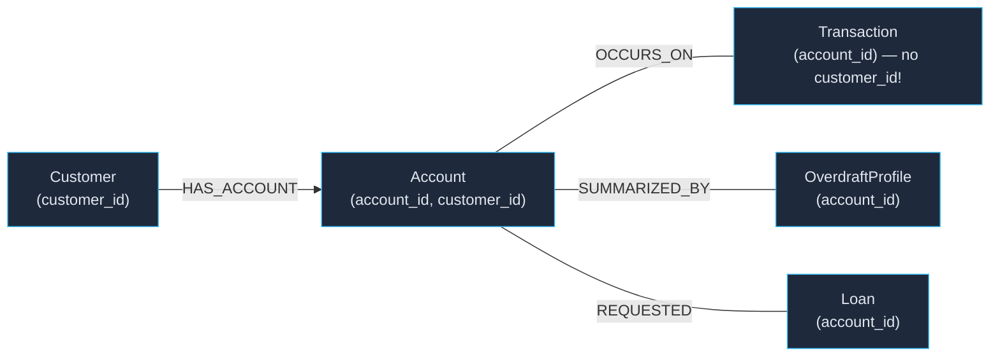
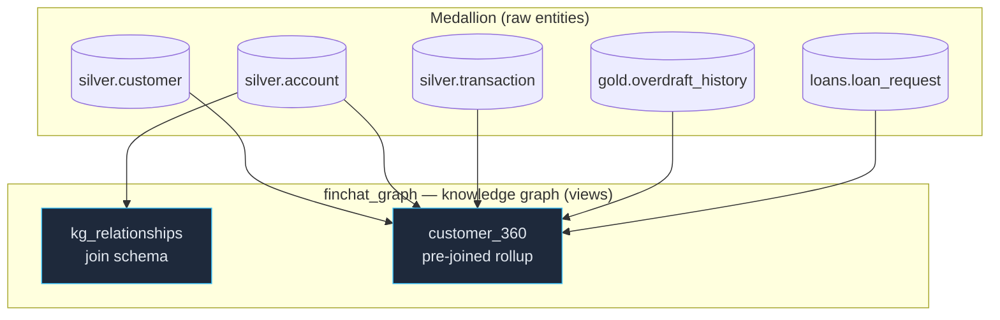
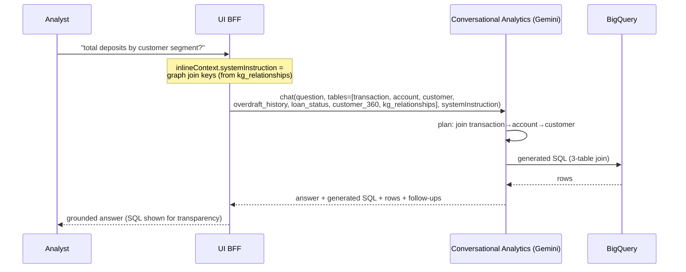

# 14 — Knowledge Graph (BigQuery semantic layer for conversational AI)

> **Why this exists.** Conversational Analytics (Gemini Data Analytics) was given the
> raw tables but **couldn't join `transaction` to `customer`** — transactions carry
> only `account_id`, never `customer_id`, so "deposits **per customer/segment**" silently
> failed or joined wrong. The Knowledge Graph encodes the data model's **entities +
> relationships** in BigQuery and a pre-joined **`customer_360`** rollup, and the analyst
> chat passes the graph's join keys to the model as a **system instruction**. Result:
> the LLM joins correctly, every time.

The graph is a **semantic overlay** (`finchat_graph_<env>`, Terraform-managed **views**
only — no data copied) over the medallion. It is the grounding layer for all analyst
conversational-AI queries.

## 1. The data model as a graph



`Account` is the **bridge**: the only path from a `Transaction` (or overdraft / loan)
to a `Customer` is `… → account.account_id` then `account.customer_id → customer`.
Missing that bridge is exactly why naive NL→SQL failed.

## 2. What's built (`finchat_graph_<env>`) — two layers

**Layer 1 — a NATIVE BigQuery property graph** (`banking_graph`, [BigQuery Graph](https://cloud.google.com/blog/products/data-analytics/introducing-bigquery-graph)):
real graph semantics over the operational tables — `Customer`, `Account`, `Transaction`,
`Loan` nodes with `OWNS` / `ON_ACCOUNT` / `REQUESTED` edges — queried with **GQL**:

```sql
SELECT segment, COUNT(*) AS txns, ROUND(SUM(amount),0) AS total
FROM GRAPH_TABLE(`…finchat_graph_prod.banking_graph`
  MATCH (c:Customer)-[:OWNS]->(a:Account)<-[:ON_ACCOUNT]-(t:Transaction)
  WHERE t.txn_type = "DEPOSIT"
  COLUMNS (c.segment AS segment, t.amount AS amount))
GROUP BY segment ORDER BY total DESC;   -- verified: matches the SQL-join numbers exactly
```

It is **metadata over the existing tables** — no copies, no storage cost; GQL queries bill
as ordinary BigQuery analysis. This is the surface for genuine graph questions (multi-hop
paths, relationship patterns — fraud-ring style traversals at enterprise scale).

**Layer 2 — relational views** (the original grounding layer):

| View | Shape | Purpose |
|---|---|---|
| `kg_relationships` | from_table·from_column → to_table·to_column · relationship | The **join schema** — the edges of the model as data (and the source of the CA system prompt) |
| `customer_360` | one row per customer: segment + account/transaction/overdraft/loan rollups | **Pre-joined** analytical backbone — per-customer questions need no joins |

> Earlier hand-rolled `kg_nodes` / `kg_edges` views (entity instances + directed
> relationships) were **pruned** once `banking_graph` arrived — the native property
> graph owns the literal graph, so those views were redundant scaffolding.
> `kg_relationships` stays: it grounds CA (join schema as data), a different job.

**Why both?** Conversational Analytics generates **SQL, not GQL** — so the views +
system-instruction remain the grounding for the analyst chat, while the property graph
serves native graph analytics. Same model, two query surfaces.

**Graph explorer + chat (console).** BigQuery Studio renders `banking_graph` visually
(Datasets → finchat_graph → Graphs) and its **Chat** (Preview) generates GQL from
natural language — verified prompt: *“Show me all customers in the PREMIER segment and
the accounts they own”* produced a correct `GRAPH_TABLE … MATCH (c:Customer)-[:OWNS]->
(a:Account)` query. Be explicit (name the graph, segments are UPPERCASE, mention
GQL/edge labels) or the assistant may fall back to plain-SQL joins. Governance note:
**column-level security enforces through `GRAPH_TABLE`** — that chat-generated query
projects policy-tagged columns (`full_name`, `account_number`), so non-fine-grained
readers are denied at the column regardless of the query surface.

`customer_360` is **CLS-safe by construction**: it exposes `customer_id` + `segment` +
aggregates, never `full_name`/`email`. DDL: [`products/graph/schemas/graph.sql`](../products/graph/schemas/graph.sql).



## 3. How conversational AI uses it

The analyst BFF (`ui/server.py`) gives Conversational Analytics **both** the raw entities
**and** the graph, then teaches it the joins:



**System instruction** (verbatim, `_ANALYST_SYSTEM_INSTRUCTION`): hard-codes the four
join keys, says to **prefer `customer_360`** for per-customer questions, defines deposit
vs withdrawal/fee sign, and forbids exposing names/emails.

**Hybrid, not graph-only — by design.** Raw tables stay in scope so CA can still answer
granular questions the rollup didn't pre-aggregate ("fee revenue by month", "deposits
over $1,000"); the graph gives the easy, join-safe path for per-customer questions. See
[ADR-0014](adr/0014-knowledge-graph-semantic-layer.md).

## 4. Verified

Live in prod — `customer_360` rolls up 7,500 customers across 4 segments
(transaction→account→customer join correct), and the analyst CA call now emits:

```sql
SELECT customer.segment,
       SUM(CASE WHEN t.txn_type='DEPOSIT' THEN t.amount ELSE 0 END) AS total_deposits,
       COUNT(t.transaction_id) AS txns
FROM `…finchat_silver_prod.transaction` t
JOIN `…finchat_silver_prod.account`  a ON t.account_id = a.account_id
JOIN `…finchat_silver_prod.customer` c ON a.customer_id = c.customer_id
GROUP BY customer.segment ORDER BY total_deposits DESC;
```

## 5. Enterprise mapping

A true graph database (Spanner Graph / Neo4j) or a dbt/LookML semantic layer is the
enterprise target for graph traversal and a governed metric layer. Here the same value —
**explicit, machine-readable relationships that ground conversational AI** — is delivered
as zero-cost BigQuery views, consistent with the dual-tier posture.

See also: [ADR-0014](adr/0014-knowledge-graph-semantic-layer.md),
[ADR-0012 (Conversational Analytics)](adr/0012-conversational-analytics.md),
[data model](data-model.md), [example conversations](15-example-conversations.md).
