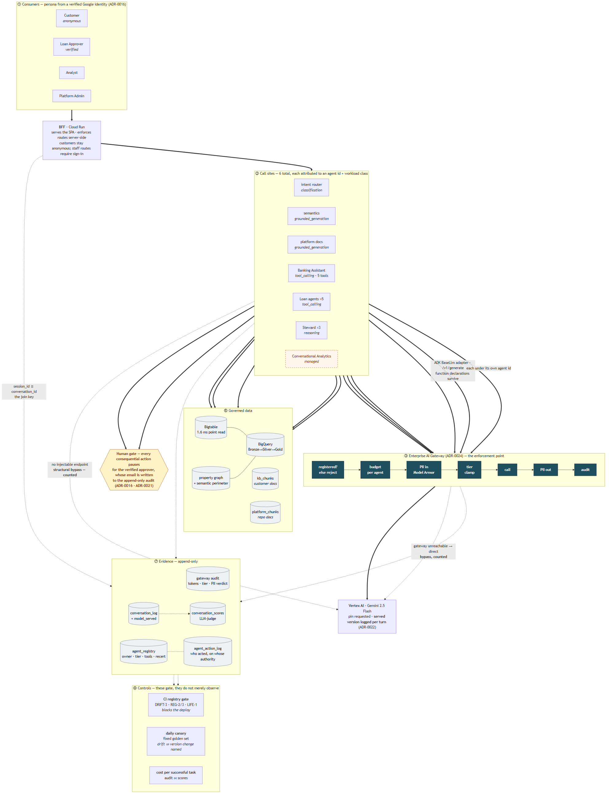

# 25 — End-to-End Flow

> One diagram for the whole platform as built: who asks, what answers, what governs it,
> what it touches, and what it leaves behind.
>
> Source: [`diagrams/end-to-end-flow.mmd`](diagrams/end-to-end-flow.mmd) ·
> rendered [PNG](diagrams/end-to-end-flow.png) / [SVG](diagrams/end-to-end-flow.svg)



## Reading it

Solid arrows are the request path. Dashed arrows are evidence and control. The eight
bands read top to bottom.

| Band | What it establishes |
|---|---|
| ① Consumers | Persona comes from a **verified Google identity**, not a dropdown. Customers stay anonymous; staff routes require sign-in ([ADR-0016](adr/0016-identity-resolved-personas.md)) |
| ② Call sites | Six, each carrying an **agent id and workload class**. That pair is what makes spend and behaviour attributable ([ADR-0023](adr/0023-agent-registry-and-identity.md)) |
| ③ Gateway | Seven steps, in order. The first rejects unregistered workloads; the fourth clamps tier; the last writes the audit row ([ADR-0024](adr/0024-enterprise-ai-gateway.md)) |
| ④ Models | One requested version, one **served** version, logged per turn ([ADR-0022](adr/0022-model-version-pinning.md)) |
| ⑤ Data | Hot path, warehouse, two RAG corpora, and the semantic perimeter |
| ⑥ Human gate | Every consequential action pauses for the verified approver |
| ⑦ Evidence | Append-only, and the join key that makes unit economics possible |
| ⑧ Controls | The three that **gate** rather than observe |

## What the diagram is designed to make obvious

**The gateway is one path, not a suggestion.** Six call sites converge on `registered?`.
Five transit; one — the managed Conversational Analytics agent — is drawn as a dashed
**structural bypass**, because it has no injectable model endpoint. Drawing the bypass is
the point: a bypass that isn't drawn is a bypass that gets reported as compliance
([docs/23](23-gateway-transit.md)).

**Tool-calling agents needed their own door.** The ADK agents reach the gateway through a
`BaseLlm` adapter on `/v1/generate`, labelled *function declarations survive*, because the
prompt-string surface would have silently stripped their tools.

**`session_id ≡ conversation_id` is load-bearing.** It is the only edge connecting cost
(gateway audit) to quality (LLM-judge scores). Without it, cost per *successful* task
degrades to cost per token — which does not error, it just stops being interesting
([docs/22](22-ai-unit-economics.md)).

**Two RAG corpora, deliberately.** `kb_chunks` answers customers; `platform_chunks`
answers engineers. Merging them would let a customer asking about overdraft fees be
answered with agent-registry internals ([docs/24](24-platform-docs-rag.md)).

## Why CI and the canary have no arrows into the flow

They are the only boxes with no edge into the request path, and that is deliberate rather
than an omission. The CI registry gate runs **before** a deploy; the canary runs **after
one, on a schedule**. Drawing either as a request-path arrow would misrepresent when it
runs and imply a per-request check that does not exist. What each one gates is stated on
the node instead.

## Regenerating

```bash
npx @mermaid-js/mermaid-cli -i docs/diagrams/end-to-end-flow.mmd \
  -o docs/diagrams/end-to-end-flow.png -b white -w 2000
```

Keep the `.mmd` and this page in step — the Mermaid source is the source of truth, and a
rendered PNG that no longer matches it is worse than no diagram.
