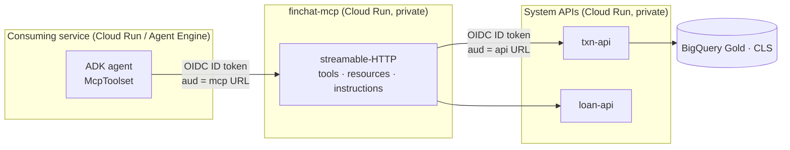

# 27 — MCP as a service surface

> FinChat's capabilities exposed over the Model Context Protocol: what is built, how
> another GCP service consumes it, and what putting an *API gateway* behind MCP
> actually costs you.
>
> Decision and rationale: [ADR-0028](adr/0028-mcp-as-the-agent-channel.md).
> Remote client authorization: [ADR-0020](adr/0020-remote-mcp-workspace-federation.md).

## 1. What exists

`mcp_server/` is a Model Context Protocol server over FinChat's governed APIs. It runs
two ways from one definition:

| | stdio | streamable-HTTP |
|---|---|---|
| Runs on | a laptop, spawned by the client | Cloud Run |
| Principal | the signed-in human (gcloud ID token) | the calling service account (OIDC), or a person via the OAuth proxy |
| Needs deploying | no | yes |
| Status | **working** | image + transport built, **not deployed** |

### Install it locally

```bash
claude mcp add finchat --scope user -- python /path/to/finchat/mcp_server/server.py
```

With no configuration it serves the transactions and loan APIs' own demo repositories,
so it works before any GCP access exists. Point it at the deployed services to serve
real data:

```bash
claude mcp add finchat --scope user \
  --env FINCHAT_TXN_API_URL=https://finchat-dev-txn-api-....run.app \
  --env FINCHAT_LOAN_API_URL=https://finchat-dev-loan-api-....run.app \
  -- python /path/to/finchat/mcp_server/server.py
```

The services are private, so the call carries an OIDC ID token minted from your gcloud
identity — which means **BigQuery's column-level security is evaluated against you**,
not against a shared key ([ADR-0019](adr/0019-end-user-credential-propagation.md)). You
need `roles/run.invoker`. `finchat_status` reports which data source is live; call it
first if a result looks unexpectedly synthetic.

| Variable | Default | Effect |
|---|---|---|
| `FINCHAT_TXN_API_URL` / `FINCHAT_LOAN_API_URL` | unset | unset → in-process demo data |
| `FINCHAT_AGENT_URL` | unset | KB via the agent's `/search`; unset → local BM25 |
| `FINCHAT_MCP_PERSONA` | `customer` | `approver` adds the loan queue and audit tools |
| `FINCHAT_MCP_ALLOW_WRITES` | off | enables `submit_loan_application` |
| `FINCHAT_MCP_TRANSPORT` | `stdio` | `http` for the Cloud Run transport |
| `FINCHAT_MCP_ALLOWED_HOSTS` | unset | required behind a proxy — see §2.4 |

### The surface

**Tools** — governed operations, all of them calls to the existing APIs:
`finchat_status`, `list_sample_accounts`, `get_account_balance`,
`get_account_transactions`, `get_recent_activity`, `get_account_summary`,
`get_loan_status`; `submit_loan_application` behind the write flag; `list_loans` and
`get_loan_audit` behind the approver persona; `search_knowledge_base` over the bank's
policies, fees and branch hours; `describe_data_model` and `lookup_glossary_term` over
the certified model.

The two knowledge tools answer different questions on purpose. `search_knowledge_base`
is the *product and policy* corpus — "what time does the Lakewood branch open", "what's
the NSF fee". `describe_data_model` is the *semantic* corpus — "what does revenue mean
here", "how do I get from a transaction to a customer". Different owners, different
lifecycles, and merging them is how a policy answer starts citing a view definition.

**Resources** — the knowledge plane, compiled from `knowledge/ontology.yaml` by
`scripts/compile_okf.py`: `finchat://knowledge/{data-model,perimeter,joins,glossary,refusals,stewardship}`,
`finchat://ontology`, `finchat://contracts/{name}`.

**Instructions** — the platform's refusal policy, verbatim from the same SSOT. This is
the only point in the protocol where a server constrains a client model's behaviour, so
it is where the rules go.

That split is the design. Tools alone give a model the ability to fetch a number and no
way to know that `PENDING` rows do not count toward a balance, or that Household is
deliberately not modelled. A tool surface without a knowledge surface produces confident
answers nobody certified.

### The knowledge base, and why it is not an agent call

`search_knowledge_base` calls the agent service's `POST /search`, which was added for this
(ADR-0028) and runs the same retrieval the agent's own tool does — dense `VECTOR_SEARCH` +
BM25 + RRF in one BigQuery job, then a Gemini rerank ([docs/21](21-hybrid-retrieval.md)).
It returns **passages**, and that is the design decision.

The tempting shortcut is to POST the question at `/chat` and hand back the agent's prose.
That stacks two models, bills the gateway twice, and gives the calling model a *summary* it
cannot cite, cannot check against the source, and cannot tell apart from a retrieval miss.
A tool that returns another agent's answer is not a tool; it is a subcontractor.

When no agent is configured — or it is unreachable, or deployed from a revision predating
`/search` — the server falls back to BM25 over the 22-document corpus it ships, labelled
`retriever: "sparse-local"`. That is a genuine fallback: exact-token questions (a zip code,
`NSF`, `$225`) are what BM25 is best at, and `test_retrieval.py` already pins the case it
gets wrong — a paraphrase sharing no tokens with the source, which is the dense arm's job.

### What is deliberately absent

`POST /v1/loans/{id}/decision` — the human-in-the-loop approval — is exposed to no
persona, and `test_mcp_server.py` asserts that under every configuration. The loan
workflow exists so that decision is a person's. A client-side confirmation prompt is a
client-side control and does not substitute.

---

## 2. Consuming it from another service on GCP

Yes, and this is the easier of the two remote cases: service-to-service on Cloud Run
needs no authorization server at all, because Google already is one.



### 2.1 Deploy

The image is built from the repo root (`mcp_server/Dockerfile`; it copies four modules
and the KB corpus from other services, guarded by `test_mcp_image.py`). Deploy it exactly like the
other services — private, scale-to-zero, its own service account:

```bash
gcloud run deploy finchat-${ENV}-mcp \
  --image ${REGION}-docker.pkg.dev/${PROJECT}/finchat/mcp:${SHA} \
  --region ${REGION} --no-allow-unauthenticated \
  --service-account finchat-${ENV}-mcp@${PROJECT}.iam.gserviceaccount.com \
  --set-env-vars "FINCHAT_MCP_TRANSPORT=http,FINCHAT_TXN_API_URL=...,FINCHAT_LOAN_API_URL=...,FINCHAT_AGENT_URL=...,FINCHAT_MCP_ALLOWED_HOSTS=finchat-${ENV}-mcp-....run.app"
```

In Terraform this is the existing `cloud_run` module plus one `invokers` entry per
consuming service account — the same shape the API Gateway service account already uses
against `txn-api`. **Note the env-var hazard**: the `cloud_run` module has
`ignore_changes` on container env precisely because CI sets the full env and Terraform
was reconciling it away. Set MCP's env in the deploy step, not in Terraform.

### 2.2 Call it from an ADK agent

```python
from google.adk.tools.mcp_tool import McpToolset, StreamableHTTPConnectionParams
import google.auth.transport.requests, google.oauth2.id_token

MCP_URL = os.environ["FINCHAT_MCP_URL"]
token = google.oauth2.id_token.fetch_id_token(
    google.auth.transport.requests.Request(), MCP_URL)

toolset = McpToolset(
    connection_params=StreamableHTTPConnectionParams(
        url=f"{MCP_URL}/mcp",
        headers={"Authorization": f"Bearer {token}"},
    )
)
agent = LlmAgent(model=gateway_model("finchat-consumer"), tools=[toolset], ...)
```

Two operational notes that are not obvious. **The ID token expires in an hour** and the
MCP session is long-lived, so mint per session and re-establish rather than holding one
connection open for a day. And **scale-to-zero plus a stateful session is a real
interaction**: a cold start lands on the initialize handshake. `stateless_http=True`
avoids pinning a session to an instance at the cost of losing server-side session state,
which this server does not use — worth setting if you deploy with more than one instance.

### 2.3 The identity question you have to answer

Service-to-service is trivial to *authenticate* and easy to get wrong on *authorization*.
The consuming service's SA is the principal, so the MCP server sees "agent-x", not "the
person agent-x is acting for". Everything ADR-0019 established about per-user CLS
evaluation is lost at that hop unless you do something about it.

| Option | What the data layer sees | When it's right |
|---|---|---|
| SA identity only | the consuming service | batch, or genuinely user-less work |
| SA + `X-End-User-Token` propagated, exchanged at the MCP server | the person | any interactive agent acting for a human — **the default** |
| OAuth proxy per ADR-0020 | the person, via their org | clients outside your trust boundary |

The middle row is the one to build, and it is the same mechanism the BFF already uses.
Skipping it means a well-behaved agent can read whatever the *agent* is entitled to on
behalf of a user who is entitled to less, which is the classic confused deputy and is
much harder to retrofit than to add.

### 2.4 The 421 you will hit

The MCP SDK's DNS-rebinding protection trusts localhost only. Behind Cloud Run's front
end the proxied `Host` header is rejected with **HTTP 421 Misdirected Request**, and
nothing in the error says why — an unauthenticated probe returns 401 first, which masks
it. Set `FINCHAT_MCP_ALLOWED_HOSTS` to the service's public host; `server.py` wires it
into `TransportSecuritySettings`.

### 2.5 Reaching it from a hosted assistant

Claude's connector flow, and the MCP authorization spec generally, does **OAuth 2.1 with
Dynamic Client Registration**. There is no field for a static token, and Google does not
support DCR, so a proxy has to bridge the two dialects. That is [ADR-0020](adr/0020-remote-mcp-workspace-federation.md),
it is designed and not built, and it is genuinely the largest remaining piece of work in
this area. Desktop clients that accept a header (Claude Code, Claude Desktop) work today
without it.

---

## 3. "Make the API gateway and the APIs an MCP service"

This is a good hackathon idea with one sharp edge in the middle of it. The edge is worth
finding on day one rather than day three.

### 3.1 API management granularity collapses at the MCP boundary

Every control an API gateway applies is keyed on **method + path**: per-operation auth,
quota, spike arrest, analytics, monetization, the developer portal's operation list.

MCP is JSON-RPC over **one POST to one path**. `tools/call` for `get_balance` and
`tools/call` for `submit_loan` are the same request line. Put an unmodified gateway in
front of an MCP server and you get one quota, one analytics row, one policy — for the
entire API estate. The dashboard will look healthy and mean nothing.

There are three honest ways out, and they are not equally good.

**A. The MCP server is a gateway client (recommended).** Tools call the gateway
per-operation over ordinary HTTP. Every existing policy, quota and analytics dimension
keeps working unchanged, because from the gateway's point of view nothing new happened —
one more consumer appeared. This is what `mcp_server/` does today, and it is why it took
a day rather than a quarter.

```
MCP client ──JSON-RPC──> MCP server ──REST per tool──> API Gateway ──> services
                         (tool → operation mapping,
                          per-tool policy, audit)
```

**B. Teach the gateway to read JSON-RPC.** In Apigee, an `ExtractVariables` /
JavaScript policy pulls `params.name` out of the body and sets a flow variable, and
Quota, SpikeArrest and analytics key on *that* instead of on the path. You get per-tool
governance at the edge, with the gateway's existing operational surface. This is the
most interesting artifact you could produce at a hackathon, and it is a real gap in the
market — but it is Apigee-specific, it does not work on Cloud API Gateway (no scripting),
and streaming responses complicate the response-side policies.

**C. One MCP endpoint per tool.** Path granularity comes back and MCP's discovery story
goes away. Mentioned for completeness; not a serious option.

Start at **A**, demo **B** as the differentiator. "We put per-tool quota and analytics on
an MCP endpoint at the gateway" is a much stronger sentence than "we wrapped our APIs in
MCP", which by then several teams will have done.

### 3.2 Generate the floor, curate the surface

The obvious move is a generator: read the OpenAPI, emit one tool per operation. Do build
it — for 200 internal APIs there is no alternative, and it makes the coverage argument.
But ship it as the *floor*, because a generated tool surface has four predictable defects:

| Generated | What it misses |
|---|---|
| One tool per operation | An agent wants *tasks*, not endpoints. Three calls to answer "can this customer afford a loan" is three chances to get the joins wrong. |
| Parameter names as documentation | `status` with no code set means the model invents `TRANSFER_OUT` and gets an empty result. |
| No semantics | Nothing says PENDING rows don't count. The number will be wrong and confident. |
| Every operation exposed | Including the ones a model must not call. Nobody audits a generated list. |

The middle path, and the thing worth demoing: **generate from the OpenAPI, then apply an
overlay** — a small YAML per API declaring which operations are exposed, which are
composed into a task-level tool, the code sets, and the refusal rules. The overlay is
reviewable, diffable and ownable by the API's team; the generator handles the other 90%.
FinChat's version of that overlay is `knowledge/ontology.yaml`.

### 3.3 What to actually build in a hackathon

Two days, in this order:

1. **Generator**: OpenAPI → MCP tools, over three or four real internal APIs. Proves scale.
2. **Overlay**: hand-curate one API into task-shaped tools with a knowledge resource
   attached. Demo the two side by side and ask the model the same question. The
   difference is the pitch.
3. **Apigee JSON-RPC policy**: per-tool quota and analytics on the MCP endpoint. This is
   the novel artifact.
4. **Identity**: SA-to-SA to make it work, `X-End-User-Token` propagation to make it
   defensible. Have the answer ready even if the demo runs on the first.
5. **A registry**: one MCP endpoint that federates the others, so a client mounts one
   server rather than forty. Also where you put the tool catalog and ownership.

Skip: a chat UI (borrow one), and OAuth/DCR (out of scope for two days — use a header
client and *say* that the OAuth proxy is the production answer).

The strongest framing for judges is not "we exposed our APIs to AI". It is: **an API
program's assets are its contracts, its policies and its catalog, and MCP is a new
binding for all three — the same governance, a new consumer class.** That is also true,
which helps.

---

## 4. Experience APIs — the next increment

### 4.1 What the term means, and where FinChat already stands

API-led connectivity splits an estate into three layers by *who the API is shaped for*:

| Layer | Shaped by | Changes when | FinChat today |
|---|---|---|---|
| **System** | the source system's domain model | the system changes | `txn-api`, `loan-api` — real, contract-first, versioned |
| **Process** | a business capability spanning systems | the business rule changes | exists, but **buried inside the BFF and the workflow** |
| **Experience** | one consuming channel | the channel's UI changes | `ui/server.py` is one, unlabelled; `mcp_server/` is now a second |

So the honest status is: FinChat has the layers and has never named them. The BFF mixes
all three — it proxies system APIs (experience), routes analyst intent and composes the
customer view (process), and serves the SPA (experience). That mixing is invisible while
there is one channel. It becomes the whole problem at two, which is exactly what shipping
the MCP server just created.

The useful evidence is already there: the MCP server took a day because the system APIs
were clean, and it needed **zero** changes to them. That is the payoff the layering
promises, observed rather than asserted.

### 4.2 Inc 29 — name the layers and prove them with a third channel

Four pieces, in dependency order:

1. **Extract the process layer.** Pull the analyst router (`_classify_intent`, `_run_kb`,
   `_run_okf`), the customer-360 composition and the loan orchestration out of
   `ui/server.py` into `process/` with their own OpenAPI contracts. They are already
   distinct functions; this is mostly a move plus a contract. The test is whether the
   BFF still knows any business rule afterwards — it should not.

2. **Declare each API's layer in the ontology**, next to the classes it serves, and add a
   CI guard on the one rule that matters: **an experience API may not call a system API
   without passing through a process API when it composes.** Direct passthrough of a
   single resource is fine; composition without a process API is what regrows the mud.

3. **Add a third channel to prove the seam.** A mobile-shaped experience API is the
   obvious candidate: one `GET /v1/home` returning balance, recent activity, loan status
   and the next action in a single round trip. It is a genuine experience API because it
   is denormalized for a screen, owns no business rules, and would be wrong for any other
   channel. Measure the chattiness delta against the SPA's five calls — that number is
   the argument for the layer.

4. **Version and own them separately.** Experience APIs change at channel speed and
   should be free to break; system APIs change at domain speed and must not. Different
   deprecation policies, stated in the contracts.

### 4.3 The failure mode to design against

An experience API that acquires business logic is not an experience API — it is a second
copy of the domain, and it drifts. The rule that keeps it honest: **an experience API may
aggregate, reshape, filter and paginate; it may not decide.** If the mobile API and the
web API can disagree about whether a loan is approvable, the logic is in the wrong layer.

This is also the answer to the question the MCP server raises. The agent channel is the
one most tempted to grow logic, because "the agent needs a tool that does X" always
sounds like a tool problem. It is usually a missing process API.

### 4.4 Sequencing

Inc 28 (this) is the MCP server. Inc 29 is the layering, and it is worth doing **before**
deploying the HTTP transport publicly: extracting process APIs will change what the MCP
tools call, and it is cheaper to move a tool's implementation before anyone depends on
its behaviour than after.
