# 28 — API-led layering, as built

> Three layers, named. What each one is allowed to do, the two rules CI enforces, and
> what is still in the wrong place.
>
> Decision and rationale: [ADR-0030](adr/0030-api-led-layering.md).
> The plan this implements: [docs/27 §4](27-mcp-service.md).

## The layers

> 
>
> Source: [`diagrams/api-layers.mmd`](diagrams/api-layers.mmd). Solid arrows are calls
> that exist; grey dashed are **passthrough**, which the rules permit; red dashed are the
> three shapes CI refuses. The analyst router is drawn in the process band with a dashed
> red border because that is where it *belongs* — it still lives in the BFF.

```
Experience   │  ui/server.py (web)   mcp_server/ (agent)   products/experience/mobile/
─────────────┼──────────────────────────────────────────────────────────────────────
Process      │  products/process/api/         composition + business rules
─────────────┼──────────────────────────────────────────────────────────────────────
System       │  txn-api    loan-api    agent    Conversational Analytics
             │  BigQuery Gold · CLS · Dataplex
```

| Layer | Shaped by | Changes when | May |
|---|---|---|---|
| **System** | the domain it owns | the domain changes | own schema, query stores, enforce access |
| **Process** | a business capability | the business rule changes | compose, orchestrate, **decide** |
| **Experience** | one channel | that channel's UI changes | aggregate, reshape, format, paginate — **never decide** |

## What exists

**`products/process/api/`** — `GET /v1/customers/by-account/{account_id}/overview`.
Composes the transactions and loan domains into one customer view and returns
`next_action`: the single most useful thing this customer could do now.

The rule is ordered by what the customer most needs to know, not by severity. A pending
loan decision outranks an overdraft because they can act on neither, but only one is news.
A **masked** balance is not treated as zero — column-level security returns NULL to a
reader without fine-grained access ([ADR-0019](adr/0019-end-user-credential-propagation.md)),
and reading that as "no money" turns a policy outcome into a false alarm.

It **degrades per source**. An unreachable loan API costs the customer their loan section,
named in `partial`, not their balance:

```json
{ "balance": -2972.49, "loans": [], "partial": ["loans"] }
```

**`mcp_server/` gained `get_customer_overview`** — the same composed view, for the agent
channel. It calls the **process** API, not the mobile one: the MCP server is itself an
experience API ([ADR-0028](adr/0028-mcp-as-the-agent-channel.md)), and composing via
another channel would make one channel depend on another's shape and uptime while putting
`next_action` in a third place.

With no process service deployed it loads `products/process/api/overview.py` **in-process**
— the same rule from the same file, not a reimplementation. That module is deliberately
free of FastAPI and pydantic so the MCP image need not ship a web framework to reuse it,
and a test asserts it stays that way.

**`products/experience/mobile/`** — `GET /v1/home?account_id=`. The same screen in **one**
round trip, shaped for a phone: `next_action` becomes a headline, amounts are
pre-formatted, activity is trimmed to what the screen draws.

```
web customer view : 3 system calls (balance, summary, transactions) + 1 per loan
mobile home       : 1
```

That delta is the measurable argument for the layer. Verified by running both services
locally and calling `/v1/home` end to end.

**`GET /v1/loans` gained an `account_id` filter.** The composition needed loans for one
account and the loan API could only return the queue. Selection belongs to the system that
owns the rows — filtering in the process layer would have worked while moving 200 records
over the wire to keep two. First real test of the layering, resolved by changing the
correct layer.

## The two rules

`scripts/test_api_layering.py`, in CI:

- **LAYER-1** — an experience API may not call a system API. Stops a channel skipping the
  middle tier "just for this one field", which is how the process layer becomes optional
  and then becomes wrong.
- **LAYER-2** — a process API may not touch a data store. Stops the middle tier becoming a
  second copy of the domain model, which is how you get two definitions of a balance.

**Neither bans passthrough.** The BFF forwards `/api/txn/*` unchanged and is right to. The
rules are about *reaching around* the process layer to compose.

The guard reads the **AST**, not the source text — its first version failed on
`process/api/backends.py`, whose docstring says importing BigQuery would break the
layering. A rule that fires on the prose explaining the rule gets fixed by deleting the
explanation.

`test_home.py` adds a structural check that no business vocabulary (`PENDING_APPROVAL`,
`overdraft`, balance comparisons) appears in the mobile channel, because that drift would
be gradual and each step defensible.

## The analyst router

The **decision** moved; the **handlers** did not, and the split is deliberate.

`products/process/api/analyst_routing.py` now owns the keyword tables, the model prompt,
the precedence rules and the order classifiers are tried in. `ui/server.py`'s
`_classify_intent` is reduced to its two transports and their credentials, and calls
`classify_async` with them injected.

That removed a real hazard rather than just moving code: **the precedence rules existed
in two copies** in `server.py`, one per model path, so a fix to one silently missed the
other. There is one copy now, and `parse_intent` is the only place a model's answer is read.

**The handlers stay in the BFF because they carry credentials.** `_run_ca` propagates the
signed-in analyst's own OAuth token so BigQuery evaluates column-level security against
them ([ADR-0019](adr/0019-end-user-credential-propagation.md)); `_run_okf` and
`_run_platform` pass `on_behalf_of` to the gateway. Moving those to another service means
forwarding end-user tokens service-to-service — a security design change, not a refactor,
and the confused-deputy risk [docs/27 §2.3](27-mcp-service.md) already names. So the rule
is shared and the credential-bound execution is not, which is the honest boundary.

`POST /v1/analyst/route` exposes the keyword half to other channels and **says so** in the
response (`"classifier": "heuristic"`), because a caller that cannot tell the model's
verdict from the fallback is exactly what nobody could see the session the model path
failed silently.

### The two copies

`analyst_routing.py` and `ui/intent.py` are **byte-identical, enforced by
`scripts/test_routing_copies.py`**. One file would be better and is not reachable: every
service image is built with its own directory as the Docker context, so `ui/` cannot COPY
out of `products/`. Moving the UI to a repo-root context would change how the live front
end deploys — a worse trade than a copy that cannot drift. Same pattern, same reasoning,
as the two copies of `gateway_llm.py`.

Verified by moving the file rather than retyping it: a first attempt reconstructed the
tables by hand and got `hits()` (word-boundary regex, not substring), the weighted scoring
and half of `PLATFORM_WORDS` wrong — each a documented fix for a real misrouting. The 16
existing router tests were not touched and are the regression proof.

**Neither new service is deployed.** They run, they are tested, and no Terraform or Cloud
Run configuration exists for them — the same position as `mcp_server/`, for the same
reason: standing them up is a cost decision that has not been taken.

## Two bugs worth recording

Both were found by verification rather than by review, and both are invisible to the
obvious check.

**The image layout.** `backends.py` resolved the demo repositories by walking a fixed
number of parents — correct in the repo, wrong in the container, where the file sits at
`/app` with the modules copied beside it. The build goes green and the service fails on
its first demo call. Caught by simulating the Dockerfile's COPY set and running the app
from it, since the local Docker daemon was down.

**Two services, one `main.py`.** Both suites passed alone and seven tests failed when run
together: `import main` resolves to whichever service was imported first. CI runs each
suite in its own working directory and would never have shown it. Both tests now load
their module by path under a unique name.
