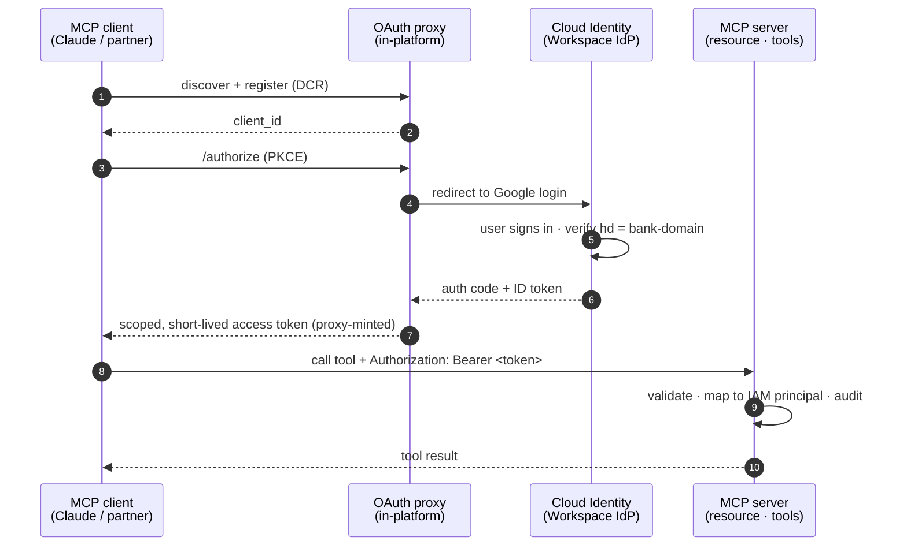

# ADR-0020 — Remote MCP access federated to Workspace / Cloud Identity via an OAuth proxy

- **Status:** Accepted
- **Date:** 2026-06-13
- **Deciders:** Principal Cloud Architect
- **Context tags:** Identity, OAuth 2.1, MCP, DCR, agent authorization, least privilege, audit

## Context

[ADR-0004](0004-agent-engine-vs-mcp.md) established MCP as a **tool/resource transport
*inside* an agent**, not the orchestration layer. [ADR-0019](0019-end-user-credential-propagation.md)
established that the **end user — not a service account — is the principal** the data
layer evaluates, by propagating the signed-in user's OAuth token to BigQuery.

This ADR covers the remaining edge: when a **remote MCP client we do not host** needs to
reach a FinChat-exposed MCP endpoint over the public internet — e.g. a managed assistant
(Claude web/mobile), a partner's agent, or a staff member's desktop client. The question
is *how that client authenticates and how the call is bound to a person*.

The naive option — a shared static `Authorization: Bearer <secret>` — is what a quick
MCP server ships with, and it is disqualifying here:

- **No identity.** Every caller is the same anonymous token; ADR-0019's per-user IAM truth
  collapses back to "whatever the token can do."
- **Hosted clients can't even send it.** Managed MCP clients (Claude's connector flow, and
  the broader MCP authorization spec) do **OAuth 2.1 with Dynamic Client Registration
  (DCR)** — they self-register and run an authorization-code + PKCE flow. There is no field
  to paste a static secret. A static-token server simply fails to connect.
- **No revocation / rotation / audit granularity.** One secret, all-or-nothing.

## Decision

**Front the MCP resource server with an OAuth proxy that speaks DCR to the client and
federates the actual login to Cloud Identity / Google Workspace.** The MCP server is a
pure **resource server**; it never mints credentials and never sees a password.

> Rendered diagram: [`../diagrams/mcp-workspace-oauth-flow.svg`](../diagrams/mcp-workspace-oauth-flow.svg)

Concretely:

- **The proxy bridges two OAuth dialects.** Hosted clients require DCR; **Google does not
  support DCR** (clients are created manually in the Cloud Console). So a thin proxy
  presents a spec-compliant authorization server *to the client* (handles DCR, `/authorize`,
  `/token`) and federates the human login *to Google* via standard OIDC. This is the single
  reason the proxy exists — remove the DCR gap and you would not need it.
- **The hosted-domain claim is the access policy.** The proxy accepts an identity only when
  the Google ID token's `hd` (hosted-domain) claim matches the bank's Workspace domain
  (extend to allowed `sub`/group membership for finer control). No allowlist to maintain;
  the org *is* the boundary. Anyone may reach `/authorize`; only an org identity gets a token.
- **The token the client carries is proxy-minted, not Google's raw token.** This lets us
  control **lifetime (short), audience (this MCP resource only, RFC 8707 resource
  indicators), and scopes** independently of Google, and keeps the IdP's tokens off the
  client. The resource server validates *our* token, not Google's.
- **The bearer token resolves to an IAM principal.** At step 8 the MCP server maps the
  validated token to the staff identity and applies the **same per-user enforcement as
  ADR-0019** — CLS/data-masking decided by BigQuery against that user, and a per-call
  **audit event**. Tool access is gated by persona/scope; *what data is visible* is decided
  at the data layer, not at the proxy.
- **Runtime path is direct.** The proxy is in the *authorization* path (steps 1–6, once per
  session), never the *data* path (step 7 goes client → resource server). It does not become
  a throughput bottleneck or a new single point of failure for tool calls.

### Implementation note (reference build)

In a sandbox this is near-turnkey with **FastMCP's `GoogleProvider` / `OAuthProxy`**
(verify domain via `hd`, mint scoped tokens). The MCP server keeps a dual-acceptance
validator so a **static service token still works for trusted in-VPC / CI callers** while
external clients use the OAuth path — the static secret never leaves the perimeter.

## Consequences

- External agent access becomes **identity-bound and auditable** without standing up a
  bespoke IdP — we reuse the org's existing one.
- First connect per user triggers a Google consent (Internal consent screen → no Google
  app-verification review, same Testing-mode caveat as ADR-0019).
- One more service to run (the proxy) and a Cloud Console OAuth client + redirect URI to
  manage; offset by deleting all shared-secret distribution.
- Enterprise hardening: place the proxy behind the API gateway
  ([ADR-0006](0006-api-gateway-vs-apigee.md)), screen tool I/O with Model Armor
  ([ADR-0008](0008-model-armor-llm-screening.md)), and bind tokens to the resource via
  RFC 8707 so a token for one MCP endpoint can't be replayed against another.

## Alternatives considered

- **Static shared bearer token.** Simplest; disqualified — no identity, no per-user
  enforcement, and hosted clients can't send it (they require DCR/OAuth).
- **Point the client straight at Google (no proxy).** Fails on DCR (Google has none) and on
  audience/resource binding — Google mints tokens audienced to the Google client, not to our
  MCP resource; you lose RFC 8707 binding and proxy-controlled lifetime/scopes.
- **Per-client API keys at the gateway.** Authenticates the *app*, not the *person*; breaks
  ADR-0019's per-user data-layer truth and complicates revocation.
- **Roll our own IdP.** Wrong tool — the org already has Cloud Identity; federate, don't
  reinvent (mirrors ADR-0019's "the user is present, use standard OAuth" stance).
