# Data Model — Banking Transactions & Loan Approval

> Realistic retail-banking schemas for the Medallion architecture. Each entity documents primary keys,
> natural keys, partitioning, clustering, retention, data classification, and lineage considerations.
> DDL lives in [`products/transactions/schemas/`](../products/transactions/schemas/) and
> [`products/loans/`](../products/loans/).

## Medallion layering — why each layer exists

| Layer | Dataset | Purpose | Fidelity | Consumers |
|-------|---------|---------|----------|-----------|
| **Bronze** | `finchat_bronze` | Raw, immutable landing of every event exactly as received (incl. malformed). Replay & audit source of truth. | As-ingested (JSON payload + metadata) | Pipelines, audit, reprocessing |
| **Silver** | `finchat_silver` | Cleansed, conformed, deduplicated, schema-enforced, PII de-identified. The canonical model. | Typed, validated, masked | Analysts, Gold builds, ML |
| **Gold** | `finchat_gold` | Business-level aggregates & serving views (balances, summaries) optimized for APIs/agents. | Curated, denormalized | DaaS APIs, agents, BI |

- **Bronze exists** so we never lose data and can replay/reprocess after logic changes — non-negotiable for a regulated ledger.
- **Silver exists** to apply quality, conformance, and governance *once*, so every downstream consumer inherits the same trusted, masked data.
- **Gold exists** to serve low-latency, business-shaped answers without re-deriving logic per query — and to expose only governed, purpose-fit data through APIs.

> **BigLake** is used for Bronze-on-GCS external/managed tables (cheap raw retention with fine-grained
> ACLs) and as the governance surface; Silver/Gold are native BigQuery for performance.

---

## Classification taxonomy

| Tag | Meaning | Example fields | Control |
|-----|---------|----------------|---------|
| `PII_DIRECT` | Directly identifies a person | full_name, email, ssn, phone | DLP de-id + column ACL + masking policy |
| `PII_FINANCIAL` | Sensitive financial data | account_number, balance, amount | Row/column security, masking for non-privileged roles |
| `CONFIDENTIAL` | Internal sensitive | risk_score, credit_profile | Restricted IAM, audit on access |
| `INTERNAL` | Non-public operational | pipeline metadata, status | Standard access |
| `PUBLIC` | Reference data | currency codes, branch list | Open within org |

---

## Data Product 1 — Banking Transactions

### Entity-relationship (logical)

```mermaid
erDiagram
    CUSTOMER ||--o{ ACCOUNT : owns
    ACCOUNT ||--o{ TRANSACTION : records
    ACCOUNT ||--o{ BALANCE_SNAPSHOT : has
    TRANSACTION ||--|| TRANSACTION_EVENT : emits
    TRANSACTION }o--|| REFERENCE_DATA : classified_by
    CUSTOMER ||--o{ AUDIT_LOG : generates
    CUSTOMER {
      string customer_id PK
      string customer_natural_key "govt-id hash, NK"
      string full_name "PII_DIRECT"
      string email "PII_DIRECT"
      string segment
      date   created_at
    }
    ACCOUNT {
      string account_id PK
      string account_number "PII_FINANCIAL, NK"
      string customer_id FK
      string account_type
      string currency FK
      string status
      timestamp opened_at
    }
    TRANSACTION {
      string transaction_id PK
      string idempotency_key "NK"
      string account_id FK
      string txn_type
      numeric amount "PII_FINANCIAL"
      string currency FK
      string counterparty_account
      string status
      timestamp event_time
      timestamp ingest_time
    }
    BALANCE_SNAPSHOT {
      string snapshot_id PK
      string account_id FK
      numeric balance "PII_FINANCIAL"
      date   as_of_date
    }
    TRANSACTION_EVENT {
      string event_id PK
      string transaction_id FK
      string event_payload "raw JSON"
      timestamp publish_time
    }
    REFERENCE_DATA {
      string code PK
      string domain
      string description
    }
    AUDIT_LOG {
      string audit_id PK
      string actor
      string action
      string resource
      timestamp event_time
    }
```

### Table specifications

| Table | PK | Natural key | Partition | Cluster | Retention | Classification |
|-------|----|-----------|-----------|---------|-----------|----------------|
| `customer` | `customer_id` (UUID) | govt-ID hash | `_PARTITIONDATE` on `created_at` | `segment`, `customer_id` | 7y (retention policy) | PII_DIRECT |
| `account` | `account_id` (UUID) | `account_number` | `DATE(opened_at)` | `customer_id`, `account_type` | 7y after closure | PII_FINANCIAL |
| `transaction` | `transaction_id` (UUID) | `idempotency_key` | `DATE(event_time)` | `account_id`, `txn_type` | 7y (regulatory) | PII_FINANCIAL |
| `balance_snapshot` | `snapshot_id` | `account_id`+`as_of_date` | `as_of_date` | `account_id` | 2y rolling | PII_FINANCIAL |
| `transaction_event` (Bronze) | `event_id` | Pub/Sub `message_id` | `DATE(publish_time)` | `transaction_id` | 400d (then GCS cold) | INTERNAL |
| `reference_data` | `code` | `domain`+`code` | none (small) | `domain` | indefinite | PUBLIC |
| `audit_log` | `audit_id` | — | `DATE(event_time)` | `actor`, `action` | 10y (immutable) | CONFIDENTIAL |

**Partitioning rationale:** time-based partitioning on `event_time`/`as_of_date` aligns with how
banking data is queried (date ranges, statements) and enables partition pruning + per-partition
expiration for retention. **Clustering** on `account_id`/`customer_id` matches the dominant access
pattern (all activity for one account) and slashes scanned bytes → lower cost at scale.

**Idempotency:** `idempotency_key` (natural key) lets the pipeline dedupe at-least-once Pub/Sub
delivery via `MERGE` into Silver — exactly-once *effect* without exactly-once *delivery*.

### Transaction types & realistic patterns
- `DEPOSIT`, `WITHDRAWAL`, `TRANSFER` (debit+credit leg), `FEE`.
- Generator constraints: **≤10,000 txns/run**, **≤4 txns/customer/run**, configurable volume.
- Realistic patterns: payroll deposits (bi-weekly clustering), small frequent withdrawals,
  occasional large transfers, monthly fees, overdraft-inducing sequences (seeded for the loan
  product's overdraft-history evaluation).

---

## Data Product 2 — Loan Approval

| Table | PK | Natural key | Partition | Cluster | Retention | Classification |
|-------|----|-----------|-----------|---------|-----------|----------------|
| `loan_request` | `loan_id` (UUID) | `customer_id`+`submitted_at` | `DATE(submitted_at)` | `status`, `customer_id` | 7y | PII_FINANCIAL |
| `credit_profile` | `profile_id` | `loan_id` | `DATE(generated_at)` | `loan_id` | 7y | CONFIDENTIAL |
| `risk_assessment` | `assessment_id` | `loan_id`+`version` | `DATE(created_at)` | `loan_id` | 7y | CONFIDENTIAL |
| `approval_decision` | `decision_id` | `loan_id`+`version` | `DATE(decided_at)` | `loan_id`, `decision` | 10y immutable | CONFIDENTIAL |
| `loan_audit_log` | `audit_id` | — | `DATE(event_time)` | `loan_id`, `actor` | 10y immutable | CONFIDENTIAL |

**Decision versioning:** every approver action writes a new `approval_decision` row with an
incrementing `version` and full `actor`/`timestamp` — append-only, never updated, so the complete
decision history is reconstructable for audit/regulatory review.

**Cross-product lineage:** the loan workflow calls the **Transaction DaaS API** to pull history and
overdraft signals. This dependency is recorded as lineage (loan `risk_assessment` ← transaction
`gold.account_summary`) so data provenance spans both products.

---

## Lineage considerations

- **Capture points:** Pub/Sub → Bronze (ingest metadata), Bronze → Silver (transform job id +
  Beam version), Silver → Gold (view/build SQL hash), Gold → API/Agent (access logs).
- **Mechanism:** Dataplex/Data Catalog lineage API + structured logging of `job_id`,
  `source_partition`, `transform_version` on every write. Each row carries `ingest_time`,
  `source_system`, and `pipeline_version` columns for inline provenance.
- **Why:** regulators require demonstrable provenance for any figure presented to a customer or used
  in a credit decision. Lineage also powers impact analysis before schema changes.
